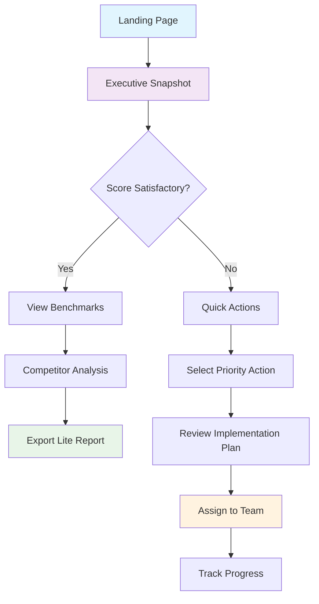
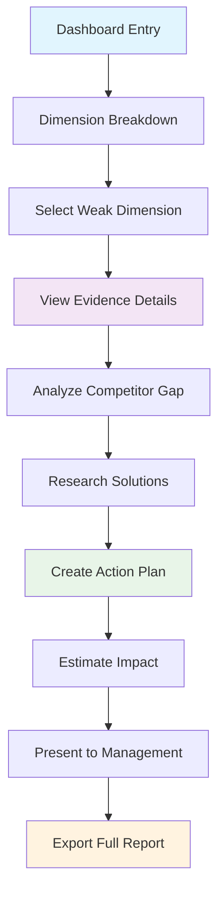
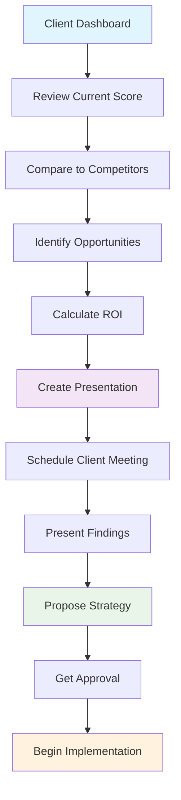

# ADI Component Library & User Flow Specifications

## 🧩 React Component Architecture

### Core Component Hierarchy

```
ADI Dashboard
├── Layout Components
│   ├── ADIHeader
│   ├── ADISidebar
│   └── ADIFooter
├── Executive Components
│   ├── ScoreGauge
│   ├── PillarBreakdown
│   ├── QuickStats
│   └── VerdictLine
├── Analysis Components
│   ├── RadarChart
│   ├── DimensionScoreCard
│   ├── StarRating
│   └── ExplainerCard
├── Benchmarking Components
│   ├── LeaderboardTable
│   ├── PercentileIndicator
│   ├── CompetitorCard
│   └── FilterControls
├── Action Components
│   ├── ActionCard
│   ├── PriorityBadge
│   ├── ImpactPredictor
│   └── ProgressTracker
├── Trend Components
│   ├── TrendChart
│   ├── AlertCard
│   ├── NotificationCenter
│   └── EventTimeline
└── Utility Components
    ├── LoadingSpinner
    ├── ErrorBoundary
    ├── TooltipProvider
    └── ModalDialog
```

## 📊 Detailed Component Specifications

### 1. ScoreGauge Component

```typescript
interface ScoreGaugeProps {
  score: number;           // 0-100
  grade: string;          // A+, A, A-, B+, B, B-, C+, C, C-, D, F
  size?: 'sm' | 'md' | 'lg';
  animated?: boolean;
  showGrade?: boolean;
  className?: string;
}

// Usage Example
<ScoreGauge 
  score={78} 
  grade="B+" 
  size="lg" 
  animated={true}
  showGrade={true}
/>
```

**Visual Specifications:**
- **Small**: 120px diameter (mobile)
- **Medium**: 160px diameter (tablet)
- **Large**: 200px diameter (desktop)
- **Arc Range**: 180 degrees (semicircle)
- **Stroke Width**: 12px for gauge, 8px for background
- **Animation**: 1.5s ease-out from 0 to target score

**Color Mapping:**
```typescript
const getScoreColor = (score: number): string => {
  if (score >= 81) return '#10B981'; // Green
  if (score >= 61) return '#F59E0B'; // Yellow
  if (score >= 41) return '#F97316'; // Orange
  return '#EF4444'; // Red
};
```

### 2. RadarChart Component

```typescript
interface RadarChartProps {
  data: DimensionScore[];
  categoryAverage?: DimensionScore[];
  size?: number;
  showGrid?: boolean;
  showLabels?: boolean;
  interactive?: boolean;
  onDimensionClick?: (dimension: string) => void;
}

interface DimensionScore {
  dimension: string;
  score: number;
  maxScore: number;
}

// Usage Example
<RadarChart 
  data={dimensionScores}
  categoryAverage={industryAverages}
  size={400}
  showGrid={true}
  interactive={true}
  onDimensionClick={handleDimensionClick}
/>
```

**Chart Configuration:**
- **Axes**: 9 dimensions evenly spaced (40° apart)
- **Scale**: 0-100 with grid lines every 20 points
- **Brand Line**: Solid blue (#2563EB) with 0.2 opacity fill
- **Category Line**: Dashed gray (#6B7280) with no fill
- **Hover**: Highlight dimension with tooltip showing exact scores

### 3. LeaderboardTable Component

```typescript
interface LeaderboardTableProps {
  data: LeaderboardEntry[];
  currentBrand?: string;
  filters: LeaderboardFilters;
  onFilterChange: (filters: LeaderboardFilters) => void;
  onBrandClick?: (brand: string) => void;
  pageSize?: number;
}

interface LeaderboardEntry {
  rank: number;
  brand: string;
  score: number;
  infrastructure: number;
  perception: number;
  commerce: number;
  strength: string;
  gap: string;
  badge?: string;
  isCurrentBrand?: boolean;
}

// Usage Example
<LeaderboardTable 
  data={leaderboardData}
  currentBrand="Your Brand"
  filters={currentFilters}
  onFilterChange={setFilters}
  pageSize={20}
/>
```

**Table Features:**
- **Sorting**: Click column headers to sort
- **Highlighting**: Current brand row highlighted in blue
- **Badges**: Trophy icons for top 3, star for top 10
- **Responsive**: Horizontal scroll on mobile
- **Pagination**: 20 entries per page with load more

### 4. ActionCard Component

```typescript
interface ActionCardProps {
  priority: 'immediate' | 'short-term' | 'strategic';
  title: string;
  description: string;
  why: string;
  steps: string[];
  expectedLift: {
    overall: number;
    dimension?: string;
    dimensionLift: number;
  };
  revenueImpact?: string;
  effort: 'low' | 'medium' | 'high';
  timeline: string;
  onStartAction?: () => void;
  onLearnMore?: () => void;
}

// Usage Example
<ActionCard 
  priority="immediate"
  title="Add Review Schema to Product Pages"
  description="Missing on 68% of PDPs, hurting AI answer quality"
  why="Competitors with reviews score 15+ points higher"
  steps={[
    "Audit current schema implementation (2 days)",
    "Implement Review markup on top 50 products (1 week)",
    "Test with Google Rich Results and validate (3 days)"
  ]}
  expectedLift={{
    overall: 8,
    dimension: "AI Answer Quality",
    dimensionLift: 15
  }}
  revenueImpact="+$180K ARR"
  effort="low"
  timeline="2 weeks"
  onStartAction={handleStartAction}
/>
```

**Priority Styling:**
- **Immediate**: Red border (#DC2626), red icon
- **Short-term**: Yellow border (#D97706), yellow icon
- **Strategic**: Green border (#059669), green icon

### 5. TrendChart Component

```typescript
interface TrendChartProps {
  data: TrendDataPoint[];
  timeRange: '3m' | '6m' | '12m';
  showEvents?: boolean;
  events?: ChartEvent[];
  height?: number;
  onPointClick?: (point: TrendDataPoint) => void;
}

interface TrendDataPoint {
  date: string;
  score: number;
  infrastructure?: number;
  perception?: number;
  commerce?: number;
}

interface ChartEvent {
  date: string;
  type: 'positive' | 'negative' | 'neutral';
  title: string;
  description: string;
}

// Usage Example
<TrendChart 
  data={scoreHistory}
  timeRange="12m"
  showEvents={true}
  events={algorithmUpdates}
  height={300}
  onPointClick={handlePointClick}
/>
```

**Chart Styling:**
- **Line**: 3px stroke, smooth curves
- **Grid**: Light gray horizontal lines
- **Events**: Colored markers with hover tooltips
- **Responsive**: Adjusts point density based on screen size

## 🎨 Design System Tokens

### Color Tokens

```typescript
export const ADIColors = {
  // Brand Colors
  primary: {
    50: '#EFF6FF',
    100: '#DBEAFE',
    500: '#2563EB',
    600: '#1D4ED8',
    900: '#1E3A8A'
  },
  
  // Score Colors
  score: {
    excellent: '#10B981',
    good: '#F59E0B',
    poor: '#EF4444'
  },
  
  // Pillar Colors
  infrastructure: '#2563EB',
  perception: '#7C3AED',
  commerce: '#059669',
  
  // Alert Colors
  alert: {
    critical: '#DC2626',
    warning: '#D97706',
    info: '#2563EB',
    success: '#059669'
  }
};
```

### Typography Tokens

```typescript
export const ADITypography = {
  display: {
    fontSize: '48px',
    lineHeight: '52px',
    fontWeight: 700,
    letterSpacing: '-0.02em'
  },
  h1: {
    fontSize: '36px',
    lineHeight: '40px',
    fontWeight: 600,
    letterSpacing: '-0.01em'
  },
  h2: {
    fontSize: '24px',
    lineHeight: '28px',
    fontWeight: 600
  },
  h3: {
    fontSize: '20px',
    lineHeight: '24px',
    fontWeight: 600
  },
  body: {
    fontSize: '16px',
    lineHeight: '24px',
    fontWeight: 400
  },
  small: {
    fontSize: '14px',
    lineHeight: '20px',
    fontWeight: 400
  },
  tiny: {
    fontSize: '12px',
    lineHeight: '16px',
    fontWeight: 500
  }
};
```

### Spacing Tokens

```typescript
export const ADISpacing = {
  xs: '4px',
  sm: '8px',
  md: '16px',
  lg: '24px',
  xl: '32px',
  '2xl': '48px',
  '3xl': '64px'
};
```

## 🔄 User Flow Diagrams

### 1. Executive User Flow



### 2. Analyst Deep Dive Flow



### 3. Agency Client Reporting Flow



## 📱 Responsive Behavior Specifications

### Breakpoint Strategy

```typescript
export const ADIBreakpoints = {
  mobile: '320px',
  tablet: '768px',
  desktop: '1024px',
  wide: '1440px'
};
```

### Component Responsive Rules

#### ScoreGauge
- **Mobile**: 120px diameter, grade below gauge
- **Tablet**: 160px diameter, grade beside gauge
- **Desktop**: 200px diameter, grade integrated in gauge

#### RadarChart
- **Mobile**: 250px diameter, simplified labels
- **Tablet**: 300px diameter, abbreviated labels
- **Desktop**: 400px diameter, full labels

#### LeaderboardTable
- **Mobile**: Horizontal scroll, sticky first column
- **Tablet**: Condensed columns, tooltip details
- **Desktop**: Full table with all columns visible

#### ActionCard
- **Mobile**: Single column, collapsed details
- **Tablet**: Two columns, expanded on tap
- **Desktop**: Three columns, hover interactions

## 🎯 Accessibility Specifications

### WCAG 2.1 AA Compliance

#### Color Contrast
- **Text on Background**: Minimum 4.5:1 ratio
- **Large Text**: Minimum 3:1 ratio
- **Interactive Elements**: Minimum 3:1 ratio

#### Keyboard Navigation
- **Tab Order**: Logical sequence through interactive elements
- **Focus Indicators**: Visible 2px outline on focus
- **Skip Links**: "Skip to main content" for screen readers

#### Screen Reader Support
- **ARIA Labels**: Descriptive labels for all interactive elements
- **Live Regions**: Score updates announced to screen readers
- **Semantic HTML**: Proper heading hierarchy and landmarks

#### Motion & Animation
- **Reduced Motion**: Respect `prefers-reduced-motion` setting
- **Auto-play**: No auto-playing animations over 5 seconds
- **Pause Controls**: User can pause/stop animations

### Implementation Example

```typescript
// Accessible ScoreGauge Component
const ScoreGauge: React.FC<ScoreGaugeProps> = ({ 
  score, 
  grade, 
  animated = true 
}) => {
  const prefersReducedMotion = useReducedMotion();
  const shouldAnimate = animated && !prefersReducedMotion;
  
  return (
    <div 
      role="img" 
      aria-label={`AI Discoverability Score: ${score} out of 100, Grade ${grade}`}
      className="score-gauge"
    >
      <svg viewBox="0 0 200 120" aria-hidden="true">
        {/* Gauge visualization */}
      </svg>
      <div className="sr-only">
        Current AI Discoverability Score is {score} points out of 100, 
        which corresponds to a grade of {grade}.
      </div>
    </div>
  );
};
```

## 🔧 Performance Optimization

### Code Splitting Strategy

```typescript
// Lazy load heavy components
const RadarChart = lazy(() => import('./components/RadarChart'));
const TrendChart = lazy(() => import('./components/TrendChart'));
const LeaderboardTable = lazy(() => import('./components/LeaderboardTable'));

// Route-based splitting
const ExecutiveDashboard = lazy(() => import('./pages/ExecutiveDashboard'));
const DimensionAnalysis = lazy(() => import('./pages/DimensionAnalysis'));
const BenchmarkingPage = lazy(() => import('./pages/BenchmarkingPage'));
```

### Data Fetching Optimization

```typescript
// SWR configuration for caching
const swrConfig = {
  revalidateOnFocus: false,
  revalidateOnReconnect: true,
  refreshInterval: 300000, // 5 minutes
  dedupingInterval: 60000,  // 1 minute
};

// Optimistic updates for user actions
const useOptimisticScore = (initialScore: number) => {
  const [optimisticScore, setOptimisticScore] = useState(initialScore);
  
  const updateScore = useCallback((newScore: number) => {
    setOptimisticScore(newScore);
    // Actual API call happens in background
  }, []);
  
  return [optimisticScore, updateScore];
};
```

### Bundle Size Targets

- **Initial Bundle**: <200KB gzipped
- **Route Chunks**: <100KB gzipped each
- **Component Chunks**: <50KB gzipped each
- **Total Bundle**: <1MB gzipped

## 🧪 Testing Strategy

### Component Testing

```typescript
// Example test for ScoreGauge component
describe('ScoreGauge', () => {
  it('renders correct score and grade', () => {
    render(<ScoreGauge score={78} grade="B+" />);
    expect(screen.getByLabelText(/78 out of 100.*Grade B\+/)).toBeInTheDocument();
  });
  
  it('respects reduced motion preference', () => {
    mockReducedMotion(true);
    render(<ScoreGauge score={78} grade="B+" animated={true} />);
    expect(screen.getByRole('img')).not.toHaveClass('animate');
  });
  
  it('applies correct color based on score', () => {
    const { rerender } = render(<ScoreGauge score={85} grade="A-" />);
    expect(screen.getByRole('img')).toHaveStyle({ color: '#10B981' });
    
    rerender(<ScoreGauge score={65} grade="C+" />);
    expect(screen.getByRole('img')).toHaveStyle({ color: '#F59E0B' });
  });
});
```

### Integration Testing

```typescript
// Example integration test for dashboard flow
describe('Executive Dashboard Flow', () => {
  it('allows executive to view score and take action', async () => {
    render(<ExecutiveDashboard />);
    
    // Score loads
    await waitFor(() => {
      expect(screen.getByLabelText(/AI Discoverability Score/)).toBeInTheDocument();
    });
    
    // Can view quick actions
    fireEvent.click(screen.getByText('Quick Actions'));
    expect(screen.getByText('Add Review Schema')).toBeInTheDocument();
    
    // Can start action
    fireEvent.click(screen.getByText('Start Implementation'));
    expect(screen.getByText('Implementation Plan')).toBeInTheDocument();
  });
});
```

### Performance Testing

```typescript
// Performance benchmarks
describe('Performance', () => {
  it('renders executive dashboard within performance budget', async () => {
    const startTime = performance.now();
    render(<ExecutiveDashboard />);
    
    await waitFor(() => {
      expect(screen.getByRole('main')).toBeInTheDocument();
    });
    
    const endTime = performance.now();
    expect(endTime - startTime).toBeLessThan(1000); // 1 second
  });
  
  it('handles large leaderboard data efficiently', () => {
    const largeDataset = generateMockLeaderboard(1000);
    const { container } = render(
      <LeaderboardTable data={largeDataset} pageSize={20} />
    );
    
    // Should only render visible rows
    expect(container.querySelectorAll('tbody tr')).toHaveLength(20);
  });
});
```

## 📋 Implementation Checklist

### Phase 1: Core Components (Week 1-2)
- [ ] Set up design system tokens
- [ ] Implement ScoreGauge component
- [ ] Create PillarBreakdown component
- [ ] Build basic layout structure
- [ ] Add responsive breakpoints

### Phase 2: Analysis Components (Week 3-4)
- [ ] Implement RadarChart component
- [ ] Create DimensionScoreCard component
- [ ] Build StarRating component
- [ ] Add ExplainerCard with hover states
- [ ] Implement accessibility features

### Phase 3: Benchmarking Components (Week 5-6)
- [ ] Create LeaderboardTable component
- [ ] Implement PercentileIndicator
- [ ] Build FilterControls component
- [ ] Add sorting and pagination
- [ ] Optimize for mobile viewing

### Phase 4: Action & Trend Components (Week 7-8)
- [ ] Implement ActionCard component
- [ ] Create TrendChart component
- [ ] Build AlertCard component
- [ ] Add NotificationCenter
- [ ] Implement real-time updates

### Phase 5: Polish & Optimization (Week 9-10)
- [ ] Performance optimization
- [ ] Accessibility audit and fixes
- [ ] Cross-browser testing
- [ ] User testing and refinements
- [ ] Documentation completion

## 🎉 Success Metrics

### Technical Metrics
- **Lighthouse Score**: >90 for Performance, Accessibility, Best Practices
- **Bundle Size**: <200KB initial, <1MB total
- **Load Time**: <2 seconds on 3G
- **Accessibility**: WCAG 2.1 AA compliance

### User Experience Metrics
- **Time to First Meaningful Paint**: <1.5 seconds
- **Time to Interactive**: <3 seconds
- **User Task Completion**: >90% success rate
- **User Satisfaction**: >4.5/5 rating

### Business Metrics
- **Engagement**: 5+ minutes average session time
- **Feature Adoption**: 80% use dimension breakdown
- **Conversion**: 15% free-to-paid conversion rate
- **Retention**: 70% monthly active users

This comprehensive component library and specification provides the complete blueprint for implementing the enhanced ADI dashboard with enterprise-grade user experience, accessibility compliance, and performance optimization.