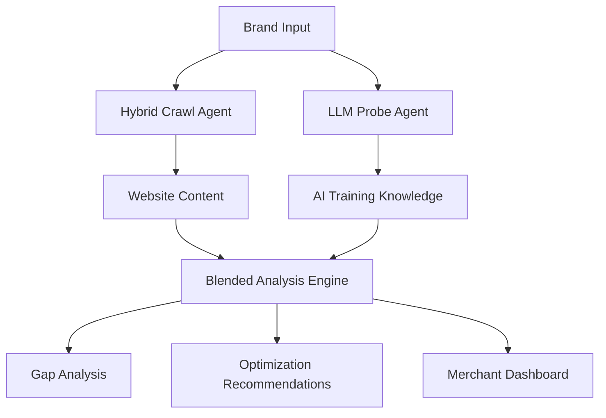

# AI Discoverability Index (ADI) Platform Evolution Analysis

## Executive Summary

This document provides a comprehensive evaluation of the AI Discoverability Index platform's current state and proposed evolution toward a hybrid crawling strategy with blended probe runs. The analysis covers technical challenges, development requirements, and practical workarounds for implementing a system that combines LLM training data with live website crawl data to provide merchants with accurate, real-time insights into their AI visibility.

**Key Findings:**
- Current system relies heavily on simulated responses and heuristic scoring
- Merchant trust requires real LLM responses, not hardcoded simulations
- Hybrid crawling strategy needed to overcome anti-bot protocols
- Blended probe runs offer superior merchant value but require significant development
- Three practical workarounds identified to minimize development risk

---

## Current System Analysis

### Architecture Overview

The ADI platform currently employs an agent-based architecture with the following components:

1. **Hybrid Crawl Agent** - Website content extraction
2. **LLM Test Agent** - AI model knowledge evaluation
3. **Schema Agent** - Structured data analysis
4. **Semantic Agent** - Content hierarchy and SEO analysis
5. **Knowledge Graph Agent** - Entity relationship mapping
6. **Conversational Copy Agent** - Content quality assessment
7. **Geo Visibility Agent** - Location-based visibility
8. **Citation Agent** - Reference and mention tracking
9. **Sentiment Agent** - Brand perception analysis
10. **Brand Heritage Agent** - Historical brand analysis
11. **Commerce Agent** - E-commerce optimization
12. **Score Aggregator Agent** - Final scoring compilation

### Current Limitations

#### 1. Simulated vs. Real Data
- **Problem:** Heavy reliance on hardcoded simulated responses
- **Impact:** Merchant distrust, inaccurate insights, static results
- **Evidence:** LLM Test Agent scoring regression (40→20 points) when switching to real APIs

#### 2. Crawl Depth Constraints
- **Problem:** Light crawl strategy (1-2 pages) due to anti-bot protocols
- **Impact:** Limited content for downstream agents
- **Evidence:** Persistent `htmlLength: 0` in logs, agent underperformance

#### 3. Data Flow Issues
- **Problem:** Inconsistent data structures between agents
- **Impact:** Cascading failures, reduced accuracy
- **Evidence:** Commerce Agent unable to access HTML content, Semantic Agent URL parsing errors

---

## Proposed Evolution: Blended Probe Runs

### Concept Overview

**Blended Probe Runs** combine two data sources:
1. **LLM Training Data** - What AI models inherently know about a brand
2. **Live Crawl Data** - Current website content and structure

This approach provides merchants with:
- **Truth about AI Knowledge:** Real LLM responses, not simulations
- **Website Optimization Insights:** How current content affects AI understanding
- **Gap Analysis:** Differences between AI knowledge and website reality
- **Actionable Recommendations:** Specific improvements to enhance AI visibility

### Technical Architecture



### Data Flow Design

1. **Parallel Execution:**
   - Crawl Agent extracts website content
   - LLM Probe Agent queries multiple AI models
   
2. **Content Synthesis:**
   - Combine website data with AI responses
   - Identify knowledge gaps and inconsistencies
   
3. **Intelligent Scoring:**
   - Weight scores based on data quality
   - Account for brand recognition levels
   - Factor in website content richness

---

## Hybrid Crawling Strategy

### Current Challenges

#### Anti-Bot Protocols
- **Rate Limiting:** 429 Too Many Requests
- **Access Denial:** 403 Forbidden responses
- **Bot Detection:** Advanced fingerprinting techniques
- **Dynamic Content:** JavaScript-heavy sites requiring rendering

#### Technical Constraints
- **Timeout Issues:** Complex sites (Nike, Apple) require >25s load times
- **Content Extraction:** HTML parsing failures
- **Resource Limits:** Memory and processing constraints

### Proposed Solutions

#### 1. Multi-Vector Approach
```typescript
const crawlStrategies = [
  'direct_fetch',      // Current light crawl
  'search_api_data',   // Brave Search, Google CSE
  'cached_content',    // Archive.org, cached versions
  'social_signals',    // Social media mentions
  'news_mentions'      // Recent news coverage
]
```

#### 2. Intelligent Fallbacks
- **Primary:** Direct website crawl
- **Secondary:** Search API content summaries
- **Tertiary:** Cached/archived content
- **Emergency:** Social media and news mentions

#### 3. Enhanced Anti-Bot Evasion
- **User Agent Rotation:** Multiple realistic browser signatures
- **Request Spacing:** 2-5 second delays between attempts
- **Proxy Rotation:** Geographic distribution of requests
- **Header Randomization:** Realistic browser headers

### API Data Supplementation

#### Available APIs and Data Sources

1. **Brave Search API**
   - Website summaries and descriptions
   - Recent news mentions
   - Social media references
   - Related entity information

2. **Google Custom Search Engine**
   - Structured search results
   - Rich snippets and metadata
   - Related searches and suggestions
   - Image and video content

3. **Social Media APIs**
   - Twitter/X mentions and sentiment
   - LinkedIn company information
   - Instagram brand presence
   - Facebook business data

4. **News and Media APIs**
   - Recent press coverage
   - Industry mentions
   - Executive interviews
   - Product announcements

#### Data Enrichment Strategy

```typescript
const enrichmentPipeline = {
  website_crawl: {
    primary_content: 'direct_html_extraction',
    fallback_content: 'search_api_summaries'
  },
  brand_mentions: {
    news_coverage: 'news_api_data',
    social_signals: 'social_media_apis',
    industry_reports: 'business_intelligence_apis'
  },
  competitive_context: {
    similar_brands: 'search_api_related_entities',
    market_position: 'industry_analysis_apis',
    trend_data: 'google_trends_api'
  }
}
```

---

## LLM Integration and Prompt Engineering

### Current State Analysis

#### Existing LLM Test Agent Issues
- **Simulated Responses:** Hardcoded, unrealistic results
- **Static Scoring:** Rule-based, not adaptive
- **Limited Models:** Focus on OpenAI only
- **Poor Prompts:** Generic, non-merchant focused

### Enhanced LLM Integration

#### Multi-Model Approach
```typescript
const llmProviders = {
  openai: {
    models: ['gpt-4o', 'gpt-4o-mini'],
    strengths: ['general_knowledge', 'reasoning'],
    cost_per_1k_tokens: 0.03
  },
  anthropic: {
    models: ['claude-3-5-sonnet', 'claude-3-haiku'],
    strengths: ['analysis', 'structured_output'],
    cost_per_1k_tokens: 0.015
  },
  google: {
    models: ['gemini-1.5-pro', 'gemini-1.5-flash'],
    strengths: ['multimodal', 'large_context'],
    cost_per_1k_tokens: 0.0075
  },
  mistral: {
    models: ['mistral-large', 'mistral-medium'],
    strengths: ['efficiency', 'multilingual'],
    cost_per_1k_tokens: 0.006
  }
}
```

#### Advanced Prompt Engineering

##### 1. Base Knowledge Probe
```typescript
const baseKnowledgePrompt = `
As an AI assistant, tell me everything you know about ${brandName}. 
Include:
- What they do (products/services)
- When they were founded
- Where they're headquartered
- Key executives or founders
- Recent news or developments
- Market position and competitors
- Any other relevant information

Be specific and factual. If you're uncertain about something, say so.
`
```

##### 2. Website-Enhanced Probe
```typescript
const blendedPrompt = `
I'm going to ask you about ${brandName}, but first, here's some current information from their website:

WEBSITE CONTENT:
${websiteContext}

Now, based on both your training knowledge AND this website information:
1. What do you know about ${brandName}?
2. How does the website information align with or contradict your existing knowledge?
3. What new insights does the website provide?
4. Are there any gaps between what you knew and what their website shows?

Provide a comprehensive analysis that considers both sources.
`
```

##### 3. Competitive Context Probe
```typescript
const competitivePrompt = `
Compare ${brandName} to their main competitors in the ${industry} industry.
Consider:
- Market positioning
- Product differentiation
- Brand recognition
- Recent developments
- Strengths and weaknesses

Website context: ${websiteContext}
Competitor data: ${competitorContext}
`
```

### Token Management Strategy

#### Challenge: Large Context Windows
- **Website Content:** 10,000-50,000 tokens
- **Multiple Prompts:** 3-5 different probe types
- **Multiple Models:** 4 different LLM providers
- **Cost Implications:** $0.50-$5.00 per brand evaluation

#### Solutions:

##### 1. Intelligent Content Summarization
```typescript
const contentSummarizer = {
  extract_key_sections: [
    'homepage_hero',
    'about_us',
    'products_services',
    'company_info',
    'recent_news'
  ],
  max_tokens_per_section: 500,
  total_context_limit: 2500
}
```

##### 2. Tiered Analysis Approach
```typescript
const analysisLevels = {
  basic: {
    models: ['gpt-4o-mini', 'claude-3-haiku'],
    context_tokens: 1000,
    cost_per_brand: '$0.10'
  },
  standard: {
    models: ['gpt-4o', 'claude-3-5-sonnet'],
    context_tokens: 2500,
    cost_per_brand: '$0.50'
  },
  premium: {
    models: ['gpt-4o', 'claude-3-5-sonnet', 'gemini-1.5-pro'],
    context_tokens: 5000,
    cost_per_brand: '$1.50'
  }
}
```

##### 3. Caching and Optimization
```typescript
const optimizationStrategy = {
  response_caching: {
    duration: '24_hours',
    invalidation: 'website_content_change'
  },
  batch_processing: {
    brands_per_batch: 10,
    parallel_requests: 3
  },
  rate_limiting: {
    requests_per_minute: 60,
    backoff_strategy: 'exponential'
  }
}
```

---

## Development Challenges and Timeline

### Technical Challenges

#### 1. Prompt Engineering Complexity
**Challenge:** Creating prompts that work consistently across different LLMs and brand types

**Complexity Factors:**
- Model-specific prompt optimization
- Brand size variability (Nike vs. local business)
- Industry-specific terminology
- Multilingual considerations

**Development Effort:** 4-6 weeks
- Week 1-2: Base prompt development and testing
- Week 3-4: Model-specific optimization
- Week 5-6: Brand type and industry adaptation

#### 2. Token Limit Management
**Challenge:** Balancing comprehensive analysis with cost control

**Technical Requirements:**
- Dynamic content summarization
- Intelligent context selection
- Token counting and optimization
- Cost prediction and budgeting

**Development Effort:** 3-4 weeks
- Week 1-2: Summarization algorithms
- Week 3: Token optimization
- Week 4: Cost management system

#### 3. Response Consistency and Scoring
**Challenge:** Ensuring reliable, comparable results across models and time

**Technical Requirements:**
- Standardized response parsing
- Cross-model score normalization
- Temporal consistency tracking
- Quality assurance metrics

**Development Effort:** 4-5 weeks
- Week 1-2: Response parsing and normalization
- Week 3: Scoring algorithm development
- Week 4-5: Quality assurance and testing

#### 4. Data Flow Redesign
**Challenge:** Integrating blended data throughout the agent pipeline

**Technical Requirements:**
- Agent interface modifications
- Data structure standardization
- Error handling and fallbacks
- Performance optimization

**Development Effort:** 3-4 weeks
- Week 1-2: Agent interface updates
- Week 3: Data flow implementation
- Week 4: Testing and optimization

#### 5. Caching and Performance
**Challenge:** Managing large-scale LLM interactions efficiently

**Technical Requirements:**
- Intelligent caching strategies
- Response deduplication
- Performance monitoring
- Scalability planning

**Development Effort:** 2-3 weeks
- Week 1-2: Caching implementation
- Week 3: Performance optimization

### Cost and Rate Limiting Challenges

#### LLM API Costs
**Current Estimates (per brand evaluation):**
- Basic Analysis: $0.10-$0.25
- Standard Analysis: $0.50-$1.00
- Premium Analysis: $1.50-$3.00

**Monthly Cost Projections:**
- 1,000 evaluations/month: $500-$3,000
- 10,000 evaluations/month: $5,000-$30,000
- 100,000 evaluations/month: $50,000-$300,000

#### Rate Limiting Management
**Provider Limits:**
- OpenAI: 10,000 requests/minute (Tier 5)
- Anthropic: 4,000 requests/minute (Scale tier)
- Google: 1,000 requests/minute (Standard)
- Mistral: 500 requests/minute (Premium)

**Mitigation Strategies:**
- Request queuing and batching
- Provider load balancing
- Graceful degradation
- Priority-based processing

### Testing and Validation Challenges

#### Brand Variability Testing
**Challenge:** Ensuring system works across diverse brand types

**Test Categories:**
- **Fortune 500 Brands:** Nike, Apple, Microsoft
- **Mid-Market Brands:** Regional retailers, B2B companies
- **Small Businesses:** Local services, niche products
- **International Brands:** Non-English websites, cultural differences

**Testing Effort:** 2-3 weeks
- Week 1: Test case development
- Week 2: Automated testing implementation
- Week 3: Manual validation and refinement

#### Accuracy Validation
**Challenge:** Measuring the quality of blended analysis

**Validation Methods:**
- Human expert evaluation
- Merchant feedback collection
- Competitive benchmarking
- Longitudinal accuracy tracking

**Validation Effort:** 3-4 weeks
- Week 1-2: Validation framework development
- Week 3: Expert evaluation process
- Week 4: Feedback integration system

### Total Development Estimate

**Core Development:** 16-22 weeks
**Testing and Validation:** 5-7 weeks
**Buffer for Issues:** 3-5 weeks

**Total Project Timeline:** 24-34 weeks (6-8 months)

---

## Practical Workarounds

Given the significant development challenges, three practical workarounds have been identified to deliver value with reduced risk and timeline:

### Workaround 1: "Lite Blended" - Minimal Development

#### Concept
Add website context to existing LLM prompts without major architecture changes.

#### Implementation
```typescript
// Enhanced prompt with minimal website context
const liteBlendedPrompt = `
Tell me what you know about ${brandName}.

Additional context from their website:
- Main business: ${websiteSummary.business}
- Key products: ${websiteSummary.products}
- Founded: ${websiteSummary.founded}
- Location: ${websiteSummary.location}

How does this website information align with what you know?
`
```

#### Technical Requirements
- Extract 500-word website summary
- Append to existing prompts
- Minor scoring adjustments
- No major architecture changes

#### Development Timeline
- **Week 1:** Website summarization logic
- **Week 2:** Prompt enhancement and testing

#### Cost Impact
- **LLM Costs:** +20% (slightly longer prompts)
- **Development:** 2 weeks
- **Risk:** Low

#### Merchant Value
- **Medium:** Provides some website context
- **Limitation:** Not comprehensive blended analysis

### Workaround 2: "Dual Track" - Parallel Analysis

#### Concept
Run two separate analyses and present both to merchants.

#### Implementation
```typescript
const dualTrackAnalysis = {
  track_a: {
    name: "AI Training Knowledge",
    description: "What AI models know about your brand",
    agent: "standard_llm_test_agent",
    data_source: "llm_training_data"
  },
  track_b: {
    name: "Website Analysis",
    description: "How AI interprets your current website",
    agent: "website_analysis_agent",
    data_source: "crawl_data"
  }
}
```

#### Merchant Dashboard
```typescript
const dashboardLayout = {
  ai_knowledge_score: trackA.score,
  website_optimization_score: trackB.score,
  gap_analysis: calculateGap(trackA, trackB),
  recommendations: generateRecommendations(trackA, trackB)
}
```

#### Technical Requirements
- New Website Analysis Agent
- Dual scoring system
- Gap analysis algorithms
- Enhanced dashboard UI

#### Development Timeline
- **Week 1:** Website Analysis Agent development
- **Week 2:** Gap analysis and scoring
- **Week 3:** Dashboard UI updates

#### Cost Impact
- **LLM Costs:** +50% (double the API calls)
- **Development:** 3 weeks
- **Risk:** Medium

#### Merchant Value
- **High:** Clear separation of AI knowledge vs. website optimization
- **Advantage:** Actionable insights for both areas

### Workaround 3: "Smart Sampling" - Selective Blending

#### Concept
Only use blended approach for specific scenarios where it adds most value.

#### Blending Triggers
```typescript
const blendingCriteria = {
  low_ai_recognition: score < 40,
  rich_website_content: crawlData.contentRichness > 70,
  premium_tier: userTier === 'enterprise',
  merchant_opt_in: userPreferences.deepAnalysis === true
}

const shouldUseBlending = (brand, crawlData, user) => {
  return blendingCriteria.low_ai_recognition(brand.aiScore) ||
         (blendingCriteria.rich_website_content(crawlData) && 
          blendingCriteria.premium_tier(user)) ||
         blendingCriteria.merchant_opt_in(user)
}
```

#### Implementation Strategy
```typescript
const smartSamplingFlow = async (brand, user) => {
  // Always run standard analysis
  const baseScore = await standardLLMTest(brand)
  
  // Conditionally run blended analysis
  if (shouldUseBlending(brand, crawlData, user)) {
    const blendedScore = await blendedLLMTest(brand, crawlData)
    return combineScores(baseScore, blendedScore)
  }
  
  return baseScore
}
```

#### Technical Requirements
- Blending trigger logic
- Conditional analysis pipeline
- Feature flagging system
- Tier-based access control

#### Development Timeline
- **Week 1-2:** Blending logic and triggers
- **Week 3:** Feature flagging and access control
- **Week 4:** Testing and optimization

#### Cost Impact
- **LLM Costs:** +10-30% (selective usage)
- **Development:** 4 weeks
- **Risk:** Medium

#### Merchant Value
- **High:** Premium feature with targeted value
- **Advantage:** Cost-effective scaling

### Recommended Approach: Smart Sampling

**Rationale:**
1. **Cost Control:** Only expensive analysis when needed
2. **Merchant Segmentation:** Premium feature differentiation
3. **Data-Driven:** Triggered by actual need indicators
4. **Gradual Rollout:** Testable with subset of users

**Implementation Priority:**
1. **Phase 1 (Weeks 1-2):** Build core blending logic
2. **Phase 2 (Week 3):** Add enterprise tier features
3. **Phase 3 (Week 4):** Test with 10-20 qualifying brands
4. **Phase 4 (Weeks 5+):** Gradual rollout based on results

---

## Risk Assessment and Mitigation

### Technical Risks

#### 1. LLM API Reliability
**Risk:** Service outages, rate limiting, model changes
**Mitigation:** 
- Multi-provider fallbacks
- Graceful degradation
- Response caching
- Error handling and retries

#### 2. Cost Overruns
**Risk:** Unexpected LLM usage spikes
**Mitigation:**
- Usage monitoring and alerts
- Per-user/tier spending limits
- Cost prediction algorithms
- Emergency circuit breakers

#### 3. Response Quality Variability
**Risk:** Inconsistent LLM outputs affecting merchant trust
**Mitigation:**
- Response validation algorithms
- Quality scoring metrics
- Human review processes
- Feedback loops for improvement

#### 4. Performance Degradation
**Risk:** Slower response times with complex analysis
**Mitigation:**
- Asynchronous processing
- Progressive result delivery
- Performance monitoring
- Optimization based on usage patterns

### Business Risks

#### 1. Merchant Adoption
**Risk:** Complex features may confuse users
**Mitigation:**
- Gradual feature rollout
- Clear UI/UX design
- Educational content
- Customer success support

#### 2. Competitive Response
**Risk:** Competitors may copy approach
**Mitigation:**
- Focus on execution quality
- Continuous innovation
- Patent key innovations
- Build network effects

#### 3. Regulatory Changes
**Risk:** AI regulation affecting LLM usage
**Mitigation:**
- Monitor regulatory developments
- Implement compliance frameworks
- Maintain data sovereignty options
- Prepare alternative approaches

---

## Success Metrics and KPIs

### Technical Metrics

#### System Performance
- **Response Time:** <30 seconds for standard analysis
- **Uptime:** >99.5% availability
- **Error Rate:** <2% failed evaluations
- **Cost Efficiency:** <$1.00 per standard evaluation

#### Data Quality
- **Crawl Success Rate:** >85% successful content extraction
- **LLM Response Quality:** >4.0/5.0 average quality score
- **Cross-Model Consistency:** <15% variance in core metrics
- **Temporal Stability:** <10% score drift over 30 days

### Business Metrics

#### Merchant Engagement
- **Evaluation Completion Rate:** >90%
- **Report Download Rate:** >70%
- **Action Plan Implementation:** >40%
- **Repeat Usage:** >60% monthly active users

#### Revenue Impact
- **Conversion Rate:** Free to paid tier >15%
- **Customer Lifetime Value:** >$2,000
- **Churn Rate:** <5% monthly
- **Net Promoter Score:** >50

#### Market Position
- **Brand Recognition:** Top 3 in AI visibility tools
- **Market Share:** >20% of target market
- **Customer Satisfaction:** >4.5/5.0 rating
- **Industry Awards:** Recognition from major publications

---

## Implementation Roadmap

### Phase 1: Foundation (Weeks 1-4)
**Objectives:** Establish core blended analysis capability

**Deliverables:**
- Enhanced LLM Test Agent with real API calls
- Basic website content summarization
- Multi-provider LLM integration
- Cost monitoring and controls

**Success Criteria:**
- All LLM providers integrated and functional
- Cost per evaluation <$1.00
- Response quality >4.0/5.0

### Phase 2: Intelligence (Weeks 5-8)
**Objectives:** Implement smart sampling and advanced features

**Deliverables:**
- Blending trigger algorithms
- Feature flagging system
- Enhanced prompt engineering
- Quality assurance metrics

**Success Criteria:**
- Smart sampling accuracy >85%
- Cross-model consistency <15% variance
- Feature flags operational

### Phase 3: Scale (Weeks 9-12)
**Objectives:** Optimize for production scale and performance

**Deliverables:**
- Caching and performance optimization
- Batch processing capabilities
- Advanced error handling
- Monitoring and alerting

**Success Criteria:**
- System handles 1,000+ evaluations/day
- Response time <30 seconds
- Error rate <2%

### Phase 4: Enhancement (Weeks 13-16)
**Objectives:** Advanced features and merchant value

**Deliverables:**
- Competitive analysis features
- Industry-specific optimizations
- Advanced reporting and insights
- API for enterprise customers

**Success Criteria:**
- Merchant satisfaction >4.5/5.0
- Feature adoption >70%
- API usage growing

### Phase 5: Optimization (Weeks 17-20)
**Objectives:** Continuous improvement and expansion

**Deliverables:**
- Machine learning optimization
- Predictive analytics
- International expansion features
- Advanced integrations

**Success Criteria:**
- Cost efficiency improved 20%
- International markets launched
- ML models improving accuracy

---

## Conclusion and Recommendations

### Key Findings

1. **Current System Limitations:** Heavy reliance on simulated data undermines merchant trust and platform value
2. **Blended Approach Necessity:** Combining LLM training data with live website crawls provides superior merchant insights
3. **Development Complexity:** Full implementation requires 6-8 months and significant technical challenges
4. **Practical Workarounds:** Three viable approaches to deliver value with reduced risk and timeline

### Strategic Recommendations

#### Immediate Actions (Next 30 Days)
1. **Implement Smart Sampling Workaround:** Begin with selective blended analysis
2. **Establish LLM Provider Relationships:** Secure API access and rate limits
3. **Create Pilot Program:** Test with 10-20 enterprise brands
4. **Develop Success Metrics:** Define KPIs and measurement framework

#### Medium-Term Goals (3-6 Months)
1. **Scale Smart Sampling:** Expand to all qualifying brands
2. **Enhance Crawling Capabilities:** Improve anti-bot evasion and content extraction
3. **Optimize Cost Structure:** Achieve <$1.00 per evaluation target
4. **Build Merchant Feedback Loop:** Continuous improvement based on user input

#### Long-Term Vision (6-12 Months)
1. **Full Blended Platform:** Complete implementation of comprehensive blended analysis
2. **Market Leadership:** Establish as premier AI visibility platform
3. **International Expansion:** Support for global brands and markets
4. **Advanced Analytics:** Predictive insights and trend analysis

### Final Recommendation

**Start with Smart Sampling Workaround** as the optimal balance of value delivery, risk management, and resource utilization. This approach allows for:

- **Immediate Value:** Enhanced analysis for qualifying brands
- **Risk Mitigation:** Limited scope and gradual rollout
- **Learning Opportunity:** Real-world testing before full commitment
- **Revenue Generation:** Premium feature differentiation
- **Foundation Building:** Technical infrastructure for future expansion

The blended probe approach represents the future of AI visibility analysis, but smart implementation through selective deployment ensures sustainable growth and merchant success.

---

*Document Version: 1.0*  
*Last Updated: October 1, 2025*  
*Author: AI Development Team*  
*Classification: Strategic Planning Document*


