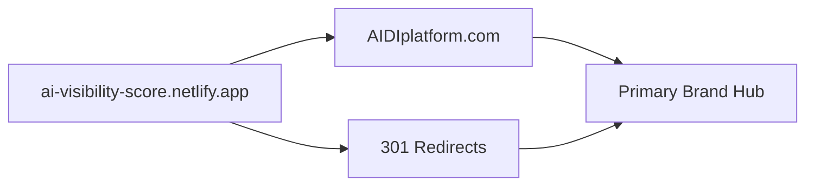
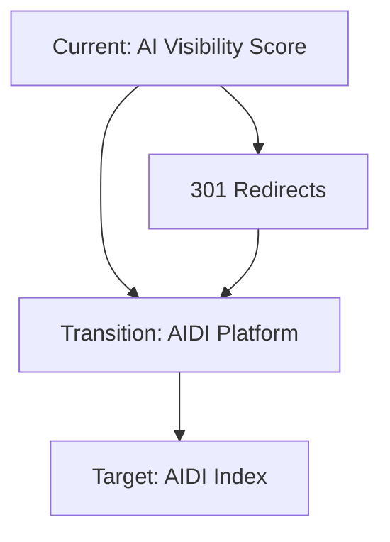

# AIDI Brand Migration Strategy
## Strategic Brand Consolidation Plan

### Executive Summary

This document outlines the comprehensive migration from "AI Visibility Score" to the **AIDI (AI Discoverability Index)** framework. This strategic consolidation addresses critical brand dilution issues and positions AIDI as the definitive standard for AI discoverability measurement.

---

## 🎯 Strategic Rationale

### Current Brand Dilution Problems
- **Brand Confusion (9/10 risk)**: Users don't understand the relationship between "AI Visibility Score" and "AIDI"
- **Marketing Dilution**: Splitting focus across two brands reduces memorability and authority
- **Competitive Weakness**: Generic "AI Visibility Score" is easily copied; "AIDI Index" is defensible
- **Premium Positioning Loss**: "Score" sounds free/basic; "Index" implies sophisticated benchmark

### AIDI Strategic Advantages
| Factor | AIDI Index | AI Visibility Score |
|--------|------------|-------------------|
| Market Differentiation | 9/10 | 4/10 |
| Thought Leadership | 9/10 | 3/10 |
| Competitive Defensibility | 9/10 | 3/10 |
| Executive Appeal | 8/10 | 6/10 |
| Premium Positioning | 9/10 | 5/10 |

---

## 🏢 AIDI Brand Hierarchy

### Primary Brand Architecture
```
🏢 AIDI Platform
   ├── 📊 AIDI Score (Free Tier)
   ├── 🔍 AIDI Index Pro (Premium Tier)
   ├── ⚙️ Multi-Agent Framework (Technical)
   └── 🏆 AIDI Certified (Certification)
```

### Product Tier Structure

#### 🏢 **AIDI Platform**
- **Full Name**: "The AI Discoverability Platform for Retail"
- **Positioning**: Enterprise-grade platform for AI visibility optimization
- **Target**: C-suite executives, marketing directors, digital strategists

#### 📊 **AIDI Score** (Free Tier)
- **Full Name**: "Get your AI discoverability score (0-100) - Free"
- **Positioning**: Entry-level assessment tool
- **Features**: Basic 13-dimension analysis, single evaluation
- **Value Prop**: "Discover how AI sees your brand"

#### 🔍 **AIDI Index Pro** (Premium Tier)
- **Full Name**: "Complete AIDI Index with competitor benchmarks, historical tracking & insights"
- **Positioning**: Professional-grade analysis and monitoring
- **Pricing**: $149-399/month
- **Features**: 
  - Comprehensive competitor benchmarking
  - Historical trend analysis
  - Priority action roadmaps
  - Executive reporting
  - API access

#### ⚙️ **Multi-Agent Framework** (Technical Differentiator)
- **Full Name**: "13-dimension analysis engine that powers AIDI"
- **Positioning**: Technical infrastructure and methodology
- **Target**: Technical teams, developers, data scientists

#### 🏆 **AIDI Certified** (Certification Program)
- **Full Name**: "AI Discoverability Certified badge program"
- **Positioning**: Industry standard certification
- **Target**: Brands seeking credible AI optimization validation

---

## 🌐 Domain Strategy

### Primary Domain Acquisition Priority
1. **AIDIplatform.com** (Primary - High Priority)
2. **AIDIindex.com** (Secondary - Medium Priority)
3. **AIDIscore.com** (Tertiary - Low Priority)
4. **AIDiscoverabilityIndex.com** (Backup - Low Priority)

### Migration Approach


### URL Structure
- **Primary**: `AIDIplatform.com`
- **Free Tool**: `AIDIplatform.com/score`
- **Premium**: `AIDIplatform.com/pro`
- **Certification**: `AIDIplatform.com/certified`
- **API**: `api.AIDIplatform.com`

---

## 📋 Technical Migration Checklist

### Phase 1: Foundation (Week 1)
#### Domain & Infrastructure
- [ ] Acquire AIDIplatform.com domain
- [ ] Set up DNS and SSL certificates
- [ ] Configure Netlify custom domain
- [ ] Implement 301 redirects from current URLs

#### Core Branding Updates
- [ ] Update package.json name: `"ai-visibility-score"` → `"aidi-platform"`
- [ ] Update README.md title and descriptions
- [ ] Update all meta tags and SEO elements
- [ ] Update favicon and site manifest

### Phase 2: Application Branding (Week 2)
#### Frontend Updates (21 files identified)
- [ ] **src/app/layout.tsx**: Update metadata, titles, descriptions
- [ ] **src/app/page.tsx**: Update main brand headers (2 instances)
- [ ] **src/app/evaluate/page.tsx**: Update headers and footer text
- [ ] **src/app/demo/page.tsx**: Update demo branding (3 instances)
- [ ] **src/app/auth/signin/page.tsx**: Update auth page branding
- [ ] **src/app/auth/signup/page.tsx**: Update signup branding (3 instances)
- [ ] **src/components/adi/reporting/PriorityActionCard.tsx**: Update PDF footer
- [ ] **src/components/adi/reporting/ExecutiveSummary.tsx**: Update score display
- [ ] **src/lib/demo-mode.ts**: Update demo descriptions
- [ ] **src/lib/ai-providers.ts**: Update User-Agent string

#### Navigation & UI Components
- [ ] Update all navigation headers to "AIDI Platform"
- [ ] Update footer copyright to "AIDI Platform"
- [ ] Update loading states and error messages
- [ ] Update email templates and notifications

### Phase 3: Content & Messaging (Week 3)
#### Product Tier Implementation
- [ ] Create AIDI Score (Free) landing page
- [ ] Create AIDI Index Pro (Premium) features page
- [ ] Implement pricing tier logic
- [ ] Update evaluation result messaging
- [ ] Create certification program pages

#### Documentation Updates
- [ ] Update all markdown documentation files
- [ ] Update API documentation
- [ ] Update deployment guides
- [ ] Create AIDI brand guidelines document

### Phase 4: Advanced Features (Week 4)
#### Premium Tier Features
- [ ] Implement "AIDI Index Pro" premium features
- [ ] Add competitor benchmarking enhancements
- [ ] Create executive dashboard views
- [ ] Implement certification tracking

#### Technical Enhancements
- [ ] Update API endpoints for brand consistency
- [ ] Implement usage analytics for tier tracking
- [ ] Add premium feature gating
- [ ] Create billing integration hooks

---

## 🎨 Brand Identity Elements

### Visual Identity
```
Primary Logo: [AIDI] with brain icon
Tagline: "The AI Discoverability Standard"
Color Palette: 
  - Primary: #2563eb (Blue)
  - Secondary: #7c3aed (Purple)
  - Accent: #059669 (Green)
```

### Messaging Framework
- **Primary Value Prop**: "The definitive standard for AI discoverability measurement"
- **Free Tier**: "Discover how AI sees your brand"
- **Premium Tier**: "Master your AI discoverability with professional insights"
- **Enterprise**: "The AI discoverability platform trusted by leading brands"

### Thought Leadership Positioning
- **Dale Parr**: "Creator of the AI Discoverability Index (AIDI)"
- **Content Focus**: "AIDI methodology", "AI discoverability best practices"
- **Industry Position**: "The authority on AI visibility optimization"

---

## 📈 Marketing Transition Strategy

### Phase 1: Soft Launch (Week 1-2)
- Update existing platform with AIDI branding
- Maintain current user base with seamless transition
- Begin content marketing with AIDI terminology

### Phase 2: Public Announcement (Week 3-4)
- Official rebrand announcement
- Press release: "Introducing AIDI: The AI Discoverability Standard"
- Social media campaign highlighting new positioning

### Phase 3: Market Leadership (Week 5-8)
- Launch AIDI Index Pro premium tier
- Begin AIDI Certified program
- Establish thought leadership content calendar

### Content Strategy
1. **Week 1-2**: "Introducing AIDI" educational content
2. **Week 3-4**: "Why AIDI Matters" thought leadership
3. **Week 5-6**: "AIDI Success Stories" case studies
4. **Week 7-8**: "The Future of AI Discoverability" vision content

---

## ⚖️ Legal Protection Strategy

### Trademark Protection
- [ ] File trademark application for "AIDI"
- [ ] File trademark for "AI Discoverability Index"
- [ ] Register "AIDI Platform" business name
- [ ] Secure social media handles (@AIDIplatform)

### Intellectual Property
- [ ] Document AIDI methodology as proprietary framework
- [ ] Create licensing terms for AIDI Certified program
- [ ] Establish usage guidelines for AIDI brand
- [ ] Protect 13-dimension evaluation framework

---

## 🔍 SEO & Content Migration

### SEO Strategy


### Keyword Migration
- **From**: "AI visibility score", "brand AI analysis"
- **To**: "AIDI index", "AI discoverability", "AIDI platform"

### Content Updates
- [ ] Update all blog posts with AIDI terminology
- [ ] Create AIDI-focused landing pages
- [ ] Optimize for "AIDI" and "AI discoverability" keywords
- [ ] Update meta descriptions and title tags

---

## 📅 Implementation Timeline

### Week 1: Strategic Foundation
- **Day 1-2**: Domain acquisition and DNS setup
- **Day 3-4**: Core application branding updates
- **Day 5-7**: Legal protection initiation

### Week 2-3: Technical Implementation
- **Week 2**: Frontend and UI updates
- **Week 3**: Content and messaging updates

### Week 4-6: Feature Enhancement
- **Week 4**: Premium tier implementation
- **Week 5**: Certification program launch
- **Week 6**: Marketing campaign launch

### Week 6-8: Market Leadership
- **Week 7**: Thought leadership content
- **Week 8**: Industry positioning and partnerships

---

## 💰 Expected Business Impact

### Revenue Projections
- **Premium Tier**: $149-399/month pricing justifies 2-3x higher revenue
- **Certification Program**: Additional $99-299 per certification
- **Enterprise Deals**: Professional positioning enables $5K-50K contracts

### Competitive Advantages
- **Brand Protection**: AIDI becomes harder to replicate
- **Market Authority**: First-mover advantage in AI discoverability
- **Premium Positioning**: Justifies higher pricing tiers
- **Thought Leadership**: Dale Parr becomes recognized industry expert

### Success Metrics
- **Brand Recognition**: 80% user association with AIDI within 6 months
- **Premium Conversion**: 15-25% free-to-paid conversion rate
- **Market Position**: Top 3 search results for "AI discoverability"
- **Revenue Growth**: 200-300% increase within 12 months

---

## 🚀 Next Steps

### Immediate Actions (This Week)
1. **Domain Acquisition**: Purchase AIDIplatform.com
2. **Legal Initiation**: Begin trademark filing process
3. **Technical Planning**: Finalize migration checklist
4. **Team Alignment**: Brief all stakeholders on strategy

### Success Criteria
- [ ] Seamless user experience during transition
- [ ] Zero downtime during domain migration
- [ ] Improved brand recognition and recall
- [ ] Higher conversion rates to premium tiers
- [ ] Established thought leadership position

---

*This strategy positions AIDI as the definitive standard for AI discoverability, creating a defensible competitive moat while enabling premium pricing and market leadership.*