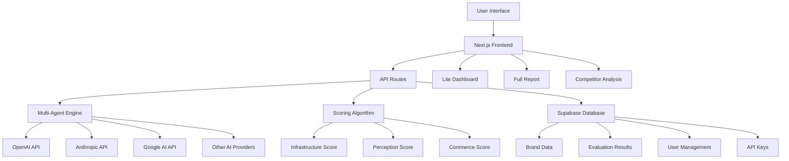

# AI Visibility Score - Technical Architecture

## Technology Stack
- **Frontend**: Next.js 14 with TypeScript, Tailwind CSS, and Shadcn/ui components
- **Backend**: Next.js API routes with serverless functions
- **Database**: Supabase (PostgreSQL) with real-time subscriptions
- **Authentication**: Supabase Auth with role-based access control
- **Deployment**: Vercel with automatic CI/CD
- **AI Integration**: Configurable multi-provider system (OpenAI, Anthropic, Google, etc.)

## System Architecture



## Database Schema Design

### Core Tables

#### brands
```sql
CREATE TABLE brands (
  id UUID PRIMARY KEY DEFAULT gen_random_uuid(),
  user_id UUID REFERENCES auth.users(id),
  name VARCHAR(255) NOT NULL,
  website_url VARCHAR(500) NOT NULL,
  industry VARCHAR(100),
  description TEXT,
  competitors TEXT[], -- Array of competitor URLs
  created_at TIMESTAMP WITH TIME ZONE DEFAULT NOW(),
  updated_at TIMESTAMP WITH TIME ZONE DEFAULT NOW()
);
```

#### evaluations
```sql
CREATE TABLE evaluations (
  id UUID PRIMARY KEY DEFAULT gen_random_uuid(),
  brand_id UUID REFERENCES brands(id),
  status VARCHAR(50) DEFAULT 'pending', -- pending, running, completed, failed
  overall_score INTEGER,
  grade VARCHAR(2), -- A, B, C, D, F
  verdict TEXT,
  strongest_dimension VARCHAR(100),
  weakest_dimension VARCHAR(100),
  biggest_opportunity VARCHAR(100),
  started_at TIMESTAMP WITH TIME ZONE DEFAULT NOW(),
  completed_at TIMESTAMP WITH TIME ZONE,
  created_at TIMESTAMP WITH TIME ZONE DEFAULT NOW()
);
```

#### dimension_scores
```sql
CREATE TABLE dimension_scores (
  id UUID PRIMARY KEY DEFAULT gen_random_uuid(),
  evaluation_id UUID REFERENCES evaluations(id),
  dimension_name VARCHAR(100) NOT NULL,
  score INTEGER NOT NULL CHECK (score >= 0 AND score <= 100),
  explanation TEXT,
  recommendations TEXT[],
  created_at TIMESTAMP WITH TIME ZONE DEFAULT NOW()
);
```

#### ai_providers
```sql
CREATE TABLE ai_providers (
  id UUID PRIMARY KEY DEFAULT gen_random_uuid(),
  user_id UUID REFERENCES auth.users(id),
  provider_name VARCHAR(50) NOT NULL, -- openai, anthropic, google, etc.
  api_key_encrypted TEXT,
  is_active BOOLEAN DEFAULT true,
  created_at TIMESTAMP WITH TIME ZONE DEFAULT NOW(),
  updated_at TIMESTAMP WITH TIME ZONE DEFAULT NOW()
);
```

#### evaluation_results
```sql
CREATE TABLE evaluation_results (
  id UUID PRIMARY KEY DEFAULT gen_random_uuid(),
  evaluation_id UUID REFERENCES evaluations(id),
  provider_name VARCHAR(50) NOT NULL,
  test_type VARCHAR(100) NOT NULL, -- infrastructure, perception, commerce
  prompt_used TEXT,
  response_received TEXT,
  score_contribution INTEGER,
  created_at TIMESTAMP WITH TIME ZONE DEFAULT NOW()
);
```

#### recommendations
```sql
CREATE TABLE recommendations (
  id UUID PRIMARY KEY DEFAULT gen_random_uuid(),
  evaluation_id UUID REFERENCES evaluations(id),
  priority INTEGER NOT NULL, -- 1 (2 weeks), 2 (30 days), 3 (90 days)
  title VARCHAR(255) NOT NULL,
  description TEXT,
  impact_level VARCHAR(20), -- high, medium, low
  effort_level VARCHAR(20), -- high, medium, low
  category VARCHAR(50), -- technical, content, reputation, etc.
  created_at TIMESTAMP WITH TIME ZONE DEFAULT NOW()
);
```

## Multi-Agent Evaluation System

### AI Provider Integration
The system supports multiple AI providers through a unified interface:

- **OpenAI**: GPT-4, GPT-3.5-turbo
- **Anthropic**: Claude-3, Claude-2
- **Google**: Gemini Pro, PaLM
- **Open Source**: LLaMA, Mistral (via API providers)

### Evaluation Process

1. **Brand Analysis Phase**
   - Website crawling and content extraction
   - Schema.org markup detection
   - Knowledge graph presence verification
   - Competitor analysis setup

2. **Multi-Agent Testing Phase**
   - Each AI model receives standardized prompts
   - Tests brand recognition and understanding
   - Evaluates recommendation accuracy
   - Assesses sentiment and trust signals

3. **Scoring and Analysis Phase**
   - Aggregate results across all models
   - Calculate dimension scores
   - Generate recommendations
   - Create executive summary

## Scoring Algorithm

### Dimension Weights
- **Infrastructure & Machine Readability**: 40%
  - Schema & Structured Data: 10%
  - Semantic Clarity: 10%
  - Ontologies & Taxonomy: 10%
  - Knowledge Graphs: 5%
  - LLM Readability: 5%

- **Perception & Reputation**: 35%
  - Geo Visibility: 10%
  - Citation Strength: 10%
  - Answer Quality: 10%
  - Sentiment & Trust: 5%

- **Commerce & Customer Experience**: 25%
  - Hero Products: 15%
  - Shipping & Freight: 10%

### Grade Calculation
- A: 90-100 points
- B: 80-89 points
- C: 70-79 points
- D: 60-69 points
- F: 0-59 points

## Key Features

### 1. Brand Onboarding Flow
- URL input and validation
- Industry selection
- Competitor identification
- Evaluation preferences

### 2. Real-time Evaluation
- Progress tracking with WebSocket updates
- Live status updates
- Estimated completion time

### 3. Executive Dashboard (Lite)
- Overall AI Visibility Score
- Grade and verdict
- Top 3 priority actions
- Strongest/weakest dimensions

### 4. Full Report System
- Detailed 5-7 page analysis
- All 8 dimension breakdowns
- Competitor benchmarking
- Complete recommendation roadmap

### 5. Actionable Recommendations
- Priority-based categorization
- Timeline-specific actions
- Impact vs effort matrix
- Implementation guidance

## Security & Performance

### API Key Management
- AES-256 encryption for stored keys
- User-level access control
- Secure key rotation capabilities

### Rate Limiting
- Per-user evaluation limits
- AI provider API rate management
- Cost control mechanisms

### Caching Strategy
- Redis-compatible caching for expensive operations
- Evaluation result caching
- Competitor data caching

### Monitoring
- Error tracking with Sentry
- Performance monitoring
- AI provider response time tracking
- Cost monitoring and alerts

## Deployment Architecture

### Vercel Configuration
- Serverless functions for API routes
- Edge functions for real-time features
- Automatic scaling
- Global CDN distribution

### Supabase Integration
- Real-time database subscriptions
- Row-level security policies
- Automatic backups
- Connection pooling

### Environment Variables
```
NEXT_PUBLIC_SUPABASE_URL=
NEXT_PUBLIC_SUPABASE_ANON_KEY=
SUPABASE_SERVICE_ROLE_KEY=
ENCRYPTION_KEY=
REDIS_URL=
SENTRY_DSN=
```

## Development Workflow

### Project Structure
```
ai-visibility-score/
├── src/
│   ├── app/                 # Next.js 14 app directory
│   ├── components/          # Reusable UI components
│   ├── lib/                 # Utility functions and configurations
│   ├── types/               # TypeScript type definitions
│   └── hooks/               # Custom React hooks
├── supabase/
│   ├── migrations/          # Database migrations
│   └── seed.sql            # Initial data
├── docs/                   # Documentation
└── tests/                  # Test files
```

### API Routes Structure
```
/api/
├── auth/                   # Authentication endpoints
├── brands/                 # Brand management
├── evaluations/            # Evaluation management
├── ai-providers/           # AI provider configuration
├── reports/                # Report generation
└── webhooks/               # External integrations
```

This architecture provides a robust, scalable foundation for the AI Visibility Score platform that can handle enterprise clients while maintaining cost-effectiveness and performance.