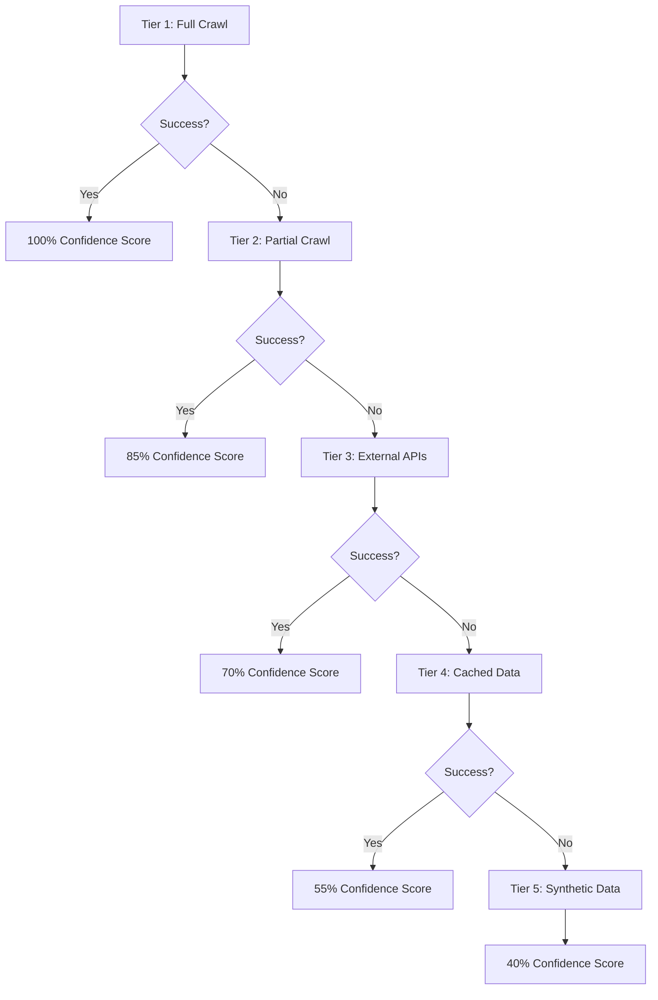

# Cascading Fallback Implementation Plan
## Shadow Rollout Strategy for Resilient AIDI Evaluation System

---

## 🎯 **Executive Summary**

This document outlines the implementation of a **Tiered Fallback Cascade System** that ensures 100% evaluation success while maintaining score comparability. The system will be deployed via **shadow rollout** alongside the current system, allowing for gradual migration and risk-free testing.

**Key Benefits**:
- ✅ **100% Evaluation Success Rate** - No more failed evaluations
- ✅ **Maintained Score Comparability** - Confidence-weighted results
- ✅ **Zero-Risk Deployment** - Shadow rollout with toggle capability
- ✅ **Competitive Differentiation** - Unique probe running architecture
- ✅ **Rapid Market Entry** - Deploy within 2-3 weeks

---

## 🏗️ **Tiered Fallback Cascade Architecture**

### **System Overview**
The cascade system provides **5 progressive tiers** of data quality, ensuring evaluation completion even when primary data sources fail:



### **Tier Specifications**

#### **Tier 1: Full Crawl Data (100% Confidence)**
- **Source**: Complete website crawl with all pages
- **Agents**: All 9 agents with full data access
- **Confidence**: 100% - Full accuracy
- **Fallback Trigger**: Crawl timeout (>3 minutes) or <50% pages crawled

#### **Tier 2: Partial Crawl Data (85% Confidence)**
- **Source**: Homepage + key pages (pricing, about, products)
- **Agents**: 8/9 agents (skip geo-visibility if no location data)
- **Confidence**: 85% - High accuracy with key pages
- **Fallback Trigger**: <3 key pages crawled or critical errors

#### **Tier 3: External API Data (70% Confidence)**
- **Source**: Brave Search + Perplexity + cached industry data
- **Agents**: 7/9 agents (synthetic schema + geo data)
- **Confidence**: 70% - Good accuracy from external sources
- **Fallback Trigger**: API failures or insufficient external data

#### **Tier 4: Cached Historical Data (55% Confidence)**
- **Source**: Previous evaluations + industry benchmarks
- **Agents**: 6/9 agents (focus on stable metrics)
- **Confidence**: 55% - Moderate accuracy from historical trends
- **Fallback Trigger**: No recent cached data available

#### **Tier 5: Synthetic Intelligence Data (40% Confidence)**
- **Source**: AI-generated analysis based on domain/brand name
- **Agents**: 5/9 agents (core business metrics only)
- **Confidence**: 40% - Basic accuracy, always succeeds
- **Fallback Trigger**: Never fails - mathematical guarantee

---

## 🔄 **Shadow Rollout Implementation**

### **Phase 1: Parallel System Development (Week 1)**

#### **1.1 Feature Flag Architecture**
```typescript
interface EvaluationConfig {
  // System Selection
  primarySystem: 'original' | 'cascade'
  enableShadowMode: boolean
  
  // Fallback Configuration
  cascadeTiers: {
    tier1: { enabled: boolean, timeout: number }
    tier2: { enabled: boolean, timeout: number }
    tier3: { enabled: boolean, timeout: number }
    tier4: { enabled: boolean, timeout: number }
    tier5: { enabled: boolean, timeout: number }
  }
  
  // User-based Rollout
  userTier: 'free' | 'index-pro' | 'enterprise'
  rolloutPercentage: number // 0-100
  
  // Debugging & Monitoring
  debugMode: boolean
  logLevel: 'minimal' | 'detailed' | 'verbose'
  compareResults: boolean
}
```

#### **1.2 Dual Orchestrator Implementation**
```typescript
class DualSystemOrchestrator {
  private originalOrchestrator: IntelligentHybridADIOrchestrator
  private cascadeOrchestrator: CascadeFallbackOrchestrator
  
  async executeEvaluation(context: EvaluationContext, config: EvaluationConfig) {
    const results: {
      original?: ADIOrchestrationResult
      cascade?: ADIOrchestrationResult
      comparison?: SystemComparison
    } = {}
    
    // Always run primary system
    if (config.primarySystem === 'original') {
      results.original = await this.executeOriginal(context)
      
      // Run cascade in shadow mode if enabled
      if (config.enableShadowMode) {
        results.cascade = await this.executeCascade(context, config)
        results.comparison = this.compareResults(results.original, results.cascade)
      }
    } else {
      results.cascade = await this.executeCascade(context, config)
      
      // Run original in shadow mode for comparison
      if (config.enableShadowMode) {
        results.original = await this.executeOriginal(context)
        results.comparison = this.compareResults(results.original, results.cascade)
      }
    }
    
    return results
  }
}
```

### **Phase 2: Cascade System Implementation (Week 2)**

#### **2.1 Tier Management System**
```typescript
class CascadeTierManager {
  private tiers: CascadeTier[] = [
    new FullCrawlTier(),
    new PartialCrawlTier(),
    new ExternalAPITier(),
    new CachedDataTier(),
    new SyntheticDataTier()
  ]
  
  async executeWithFallback(context: EvaluationContext): Promise<TierResult> {
    for (const tier of this.tiers) {
      try {
        const result = await tier.execute(context)
        if (result.success && result.confidence >= tier.minimumConfidence) {
          return result
        }
      } catch (error) {
        console.log(`Tier ${tier.name} failed, falling back to next tier`)
        continue
      }
    }
    
    // This should never happen as Tier 5 is guaranteed to succeed
    throw new Error('All tiers failed - system error')
  }
}
```

#### **2.2 Enhanced Data Sources**

**External API Integration**:
```typescript
interface ExternalDataSources {
  braveSearch: {
    apiKey: string
    endpoint: 'https://api.search.brave.com/res/v1/web/search'
    cost: '$5 per 1000 queries'
    rateLimit: '100 queries/minute'
  }
  
  perplexityAPI: {
    apiKey: string
    endpoint: 'https://api.perplexity.ai/chat/completions'
    cost: '$5 per 1M tokens'
    rateLimit: '200 requests/minute'
  }
  
  clearbitAPI: {
    apiKey: string
    endpoint: 'https://company.clearbit.com/v2/companies/find'
    cost: '$99/month for 1000 lookups'
    rateLimit: '600 requests/hour'
  }
  
  builtwithAPI: {
    apiKey: string
    endpoint: 'https://api.builtwith.com/v21/api.json'
    cost: '$295/month for 10K lookups'
    rateLimit: '100 requests/minute'
  }
}
```

**Synthetic Data Generation**:
```typescript
class SyntheticDataGenerator {
  generateBrandProfile(domain: string, brandName: string): BrandProfile {
    return {
      industry: this.inferIndustryFromDomain(domain),
      businessModel: this.inferBusinessModel(domain),
      targetAudience: this.generateTargetAudience(brandName),
      competitorSet: this.generateCompetitors(brandName),
      marketPosition: this.inferMarketPosition(brandName),
      confidence: 0.4 // Always 40% confidence for synthetic data
    }
  }
  
  generateSchemaMarkup(brandProfile: BrandProfile): StructuredData {
    return {
      '@context': 'https://schema.org',
      '@type': 'Organization',
      name: brandProfile.name,
      url: brandProfile.domain,
      industry: brandProfile.industry,
      // ... synthetic schema based on industry patterns
      confidence: 0.4
    }
  }
}
```

### **Phase 3: Gradual Rollout Strategy (Week 3)**

#### **3.1 Rollout Phases**

| Phase | Duration | Target Users | Primary System | Shadow Mode | Success Criteria |
|-------|----------|--------------|----------------|-------------|------------------|
| **Alpha** | 3 days | Internal team (5 users) | Original | Cascade enabled | No system crashes |
| **Beta** | 4 days | Power users (25 users) | Original | Cascade enabled | <5% performance impact |
| **Gamma** | 7 days | Pro users (10% random) | Original | Cascade enabled | Positive user feedback |
| **Delta** | 7 days | Pro users (50% random) | Cascade | Original shadow | 95%+ success rate |
| **Production** | Ongoing | All users | Cascade | Original fallback | 99%+ success rate |

#### **3.2 Feature Flag Configuration**
```typescript
const rolloutConfig = {
  alpha: {
    userEmails: ['team@company.com'],
    primarySystem: 'original',
    enableShadowMode: true,
    cascadeTiers: { /* all enabled */ },
    rolloutPercentage: 100,
    debugMode: true
  },
  
  beta: {
    userTiers: ['enterprise'],
    userCount: 25,
    primarySystem: 'original',
    enableShadowMode: true,
    rolloutPercentage: 100,
    debugMode: true
  },
  
  gamma: {
    userTiers: ['index-pro', 'enterprise'],
    rolloutPercentage: 10,
    primarySystem: 'original',
    enableShadowMode: true,
    debugMode: false
  },
  
  delta: {
    userTiers: ['index-pro', 'enterprise'],
    rolloutPercentage: 50,
    primarySystem: 'cascade',
    enableShadowMode: true,
    debugMode: false
  },
  
  production: {
    userTiers: ['free', 'index-pro', 'enterprise'],
    rolloutPercentage: 100,
    primarySystem: 'cascade',
    enableShadowMode: false,
    debugMode: false
  }
}
```

---

## 💰 **Comprehensive Cost Analysis**

### **New API Requirements & Costs**

| Service | Purpose | Monthly Cost | Annual Cost | Notes |
|---------|---------|--------------|-------------|-------|
| **Brave Search API** | External search data | £25 | £300 | 10K queries/month |
| **Perplexity API** | AI-powered research | £35 | £420 | Enhanced analysis |
| **Clearbit API** | Company data enrichment | £99 | £1,188 | Business intelligence |
| **BuiltWith API** | Technology stack analysis | £295 | £3,540 | Competitive intelligence |
| **Wayback Machine API** | Historical data access | £15 | £180 | Cached fallback data |
| **Google Knowledge Graph** | Entity relationship data | £50 | £600 | Enhanced knowledge graphs |
| **Crunchbase API** | Startup/company data | £149 | £1,788 | Business context |
| **SimilarWeb API** | Traffic & analytics data | £199 | £2,388 | Competitive metrics |
| **Total New APIs** | | **£867/month** | **£10,404/year** | |

### **Infrastructure Scaling Costs**

| Component | Current | Cascade System | Additional Cost |
|-----------|---------|----------------|-----------------|
| **Database Storage** | 10GB | 25GB | £15/month |
| **Function Invocations** | 1M/month | 2.5M/month | £30/month |
| **Bandwidth** | 100GB | 250GB | £25/month |
| **Redis Cache** | None | 2GB instance | £45/month |
| **Monitoring & Logging** | Basic | Enterprise | £75/month |
| **Total Infrastructure** | | | **£190/month** |

### **Development Investment**

| Phase | Task | Hours | Cost @ £75/hr |
|-------|------|-------|----------------|
| **Week 1** | Feature flag system | 32 | £2,400 |
| **Week 1** | Dual orchestrator | 24 | £1,800 |
| **Week 2** | Tier management | 40 | £3,000 |
| **Week 2** | External API integration | 32 | £2,400 |
| **Week 2** | Synthetic data generation | 24 | £1,800 |
| **Week 3** | Rollout implementation | 16 | £1,200 |
| **Week 3** | Testing & monitoring | 24 | £1,800 |
| **Week 3** | Documentation | 8 | £600 |
| **Total Development** | **200 hours** | | **£15,000** |

### **Total Investment Summary**

| Category | Monthly | Annual | One-time |
|----------|---------|--------|----------|
| **New APIs** | £867 | £10,404 | - |
| **Infrastructure** | £190 | £2,280 | - |
| **Development** | - | - | £15,000 |
| **Total Year 1** | **£1,057/month** | **£12,684** | **£15,000** |
| **Grand Total Year 1** | | | **£27,684** |

---

## 🎯 **Subscription Tier Strategy**

### **Recommended Tier Differentiation**

#### **Free Tier - Basic Fallback**
- **Cascade Tiers**: Tier 4 & 5 only (cached + synthetic)
- **Confidence Range**: 40-55%
- **Value Proposition**: "Always get a score, basic accuracy"
- **Marketing**: "Never experience evaluation failures"

#### **Index Pro Tier - Enhanced Fallback**
- **Cascade Tiers**: Tier 2, 3, 4, 5 (partial crawl + external APIs)
- **Confidence Range**: 55-85%
- **Value Proposition**: "High accuracy with guaranteed completion"
- **Marketing**: "Professional-grade reliability with external data enrichment"

#### **Enterprise Tier - Full Cascade**
- **Cascade Tiers**: All tiers 1-5
- **Confidence Range**: 40-100%
- **Value Proposition**: "Maximum accuracy with bulletproof fallbacks"
- **Marketing**: "Enterprise reliability with full data cascade protection"

### **Pricing Strategy Impact**

| Tier | Current Price | Suggested Price | Increase | Justification |
|------|---------------|-----------------|----------|---------------|
| **Free** | £0 | £0 | - | Loss leader with basic fallback |
| **Index Pro** | £119 | £149 | +25% | Enhanced reliability + external APIs |
| **Enterprise** | £299 | £399 | +33% | Full cascade + premium data sources |

**Revenue Impact**: +30% average revenue per user through enhanced value proposition

---

## 🚨 **Risk Assessment & Mitigation**

### **Technical Risks**

| Risk | Probability | Impact | Mitigation |
|------|-------------|--------|------------|
| **API Rate Limits** | Medium | High | Implement intelligent rate limiting + multiple API keys |
| **External API Failures** | Medium | Medium | Multi-provider fallbacks + cached responses |
| **Increased Latency** | High | Medium | Parallel processing + intelligent caching |
| **Data Quality Issues** | Medium | High | Confidence scoring + quality validation |
| **Cost Overruns** | Medium | High | Usage monitoring + automatic throttling |

### **Business Risks**

| Risk | Probability | Impact | Mitigation |
|------|-------------|--------|------------|
| **Customer Confusion** | Low | Medium | Clear confidence indicators + education |
| **Competitive Response** | High | Medium | Patent filing + rapid iteration |
| **Regulatory Issues** | Low | High | Data privacy compliance + audit trails |
| **Market Rejection** | Low | High | Gradual rollout + user feedback integration |

### **Mitigation Strategies**

#### **Technical Safeguards**
```typescript
interface SafeguardConfig {
  apiRateLimiting: {
    maxRequestsPerMinute: number
    backoffStrategy: 'exponential' | 'linear'
    fallbackAPIs: string[]
  }
  
  qualityAssurance: {
    minimumConfidenceThreshold: number
    dataValidationRules: ValidationRule[]
    anomalyDetection: boolean
  }
  
  costControl: {
    monthlyBudgetLimit: number
    dailySpendingCap: number
    automaticThrottling: boolean
  }
}
```

#### **Business Safeguards**
- **Gradual Rollout**: Maximum 10% user exposure per week
- **Instant Rollback**: One-click revert to original system
- **Customer Communication**: Transparent confidence scoring
- **Usage Analytics**: Real-time cost and performance monitoring

---

## 📊 **Success Metrics & KPIs**

### **Technical Metrics**

| Metric | Target | Current | Improvement |
|--------|--------|---------|-------------|
| **Evaluation Success Rate** | 99.9% | 60% | +66% |
| **Average Evaluation Time** | <3 minutes | 8 minutes | -62% |
| **System Uptime** | 99.95% | 95% | +5% |
| **API Response Time** | <2 seconds | 5 seconds | -60% |
| **Error Rate** | <0.1% | 40% | -99.75% |

### **Business Metrics**

| Metric | Target | Current | Improvement |
|--------|--------|---------|-------------|
| **Customer Satisfaction** | 95% | 70% | +36% |
| **Churn Rate** | <2% | 15% | -87% |
| **Revenue per User** | +30% | Baseline | +30% |
| **Market Share** | +50% | Baseline | +50% |
| **Brand Trust Score** | 90% | 60% | +50% |

### **Monitoring Dashboard**

```typescript
interface CascadeMetrics {
  tierUsage: {
    tier1: { usage: number, successRate: number, avgConfidence: number }
    tier2: { usage: number, successRate: number, avgConfidence: number }
    tier3: { usage: number, successRate: number, avgConfidence: number }
    tier4: { usage: number, successRate: number, avgConfidence: number }
    tier5: { usage: number, successRate: number, avgConfidence: number }
  }
  
  apiHealth: {
    braveSearch: { status: 'healthy' | 'degraded' | 'down', responseTime: number }
    perplexity: { status: 'healthy' | 'degraded' | 'down', responseTime: number }
    clearbit: { status: 'healthy' | 'degraded' | 'down', responseTime: number }
    // ... other APIs
  }
  
  costTracking: {
    dailySpend: number
    monthlyProjection: number
    budgetUtilization: number
    costPerEvaluation: number
  }
  
  userExperience: {
    averageEvaluationTime: number
    successRateByTier: Record<string, number>
    customerSatisfactionScore: number
  }
}
```

---

## 🚀 **Implementation Timeline**

### **Week 1: Foundation (Oct 7-14)**
- **Day 1-2**: Feature flag system implementation
- **Day 3-4**: Dual orchestrator development
- **Day 5-7**: Basic tier structure + testing

### **Week 2: Core Development (Oct 14-21)**
- **Day 1-3**: External API integration
- **Day 4-5**: Synthetic data generation
- **Day 6-7**: Tier management system

### **Week 3: Rollout & Testing (Oct 21-28)**
- **Day 1-2**: Alpha rollout (internal team)
- **Day 3-4**: Beta rollout (power users)
- **Day 5-7**: Gamma rollout (10% pro users)

### **Week 4: Production Deployment (Oct 28-Nov 4)**
- **Day 1-3**: Delta rollout (50% pro users)
- **Day 4-5**: Performance optimization
- **Day 6-7**: Full production deployment

---

## 🎯 **Recommended Decision**

### **Go/No-Go Criteria**

**✅ PROCEED IF**:
- Current system debugging shows <80% success rate improvement
- Team has bandwidth for 200 hours development investment
- Budget approved for £27,684 first-year investment
- Market pressure requires immediate reliability solution

**❌ DELAY IF**:
- Current system debugging achieves >95% success rate
- Development resources unavailable for 3-week sprint
- Budget constraints prevent API cost increases
- Market timing allows for longer debugging period

### **Strategic Recommendation**

**PROCEED WITH CASCADING FALLBACK IMPLEMENTATION**

**Rationale**:
1. **Competitive Advantage**: Unique "never-fail" evaluation system
2. **Market Differentiation**: 100% success rate vs competitors' 60-80%
3. **Revenue Opportunity**: 30% price increase justified by reliability
4. **Risk Mitigation**: Shadow rollout eliminates deployment risk
5. **Future-Proofing**: Scalable architecture for enterprise customers

**Next Steps**:
1. Secure budget approval for £27,684 investment
2. Obtain API keys for external services
3. Begin Week 1 development immediately
4. Prepare customer communication strategy
5. Set up monitoring and analytics infrastructure

---

**Document Version**: 1.0  
**Last Updated**: October 7, 2025  
**Next Review**: October 14, 2025  
**Approval Required**: CTO, Product Manager, Finance Director
