# Netlify-Railway Bridge Development Roadmap
## Comprehensive Implementation Plan for AIDI Production System

---

## 🎯 **Executive Summary**

This roadmap outlines the complete implementation of a **Netlify-Railway Bridge Architecture** to solve the current AIDI evaluation system failures. The solution maintains Netlify for fast operations while leveraging Railway for persistent background processing.

**Timeline**: 3 weeks  
**Investment**: £15,000 development + £50/month infrastructure  
**Success Target**: 95%+ evaluation completion rate  
**Risk Level**: Low (incremental migration with rollback capability)

---

## 📊 **Current State vs Target State**

### **Current State (Broken)**

```mermaid
graph TD
    A[User Request] --> B[Netlify Function]
    B --> C[All 9 Agents in Serverless]
    C --> D[15-minute Timeout]
    D --> E[❌ 100% Failure Rate]
```


### **Target State (Bridge Architecture)**


---

## 🗓️ **3-Week Implementation Timeline**

### **Week 1: Foundation & Infrastructure**
| Day | Focus | Deliverables | Success Criteria |
|-----|-------|--------------|------------------|
| **Mon** | Railway Setup | Railway account, basic app deployment | Health check endpoint responding |
| **Tue** | Bridge Authentication | JWT token system, secure communication | Tokens generated and verified |
| **Wed** | Queue Infrastructure | Redis setup, Bull queue implementation | Queue accepts and processes jobs |
| **Thu** | Netlify Bridge Endpoint | API route for Railway communication | Successful job enqueueing |
| **Fri** | Crawl Agent Migration | Move crawl_agent to Railway | Single agent working end-to-end |

### **Week 2: Agent Migration & Integration**
| Day | Focus | Deliverables | Success Criteria |
|-----|-------|--------------|------------------|
| **Mon** | Citation Agent Migration | Move citation_agent to Railway | Two agents working in parallel |
| **Tue** | Commerce Agent Migration | Move commerce_agent to Railway | Three agents working reliably |
| **Wed** | Sentiment Agent Migration | Move sentiment_agent to Railway | All slow agents on Railway |
| **Thu** | Results Aggregation | Combine Netlify + Railway results | Complete evaluations generated |
| **Fri** | Error Handling & Monitoring | Comprehensive error handling | Graceful failure recovery |

### **Week 3: Production Deployment & Optimization**
| Day | Focus | Deliverables | Success Criteria |
|-----|-------|--------------|------------------|
| **Mon** | Production Environment | Railway production deployment | Production-ready infrastructure |
| **Tue** | Gradual Rollout (10%) | Feature flag for 10% of users | 10% of evaluations using bridge |
| **Wed** | Monitoring & Metrics | Full observability dashboard | Real-time system health visibility |
| **Thu** | Rollout Expansion (50%) | Increase to 50% of evaluations | 50% success rate validation |
| **Fri** | Full Production (100%) | Complete migration to bridge | 95%+ evaluation success rate |

---

## 🏗️ **Technical Architecture Specifications**

### **Netlify Infrastructure (Frontend + Fast Agents)**

#### **1. Enhanced API Routes**
```typescript
// src/app/api/evaluate/route.ts - Enhanced Version
export async function POST(request: NextRequest) {
  const { websiteUrl, tier } = await request.json()
  
  // Create evaluation with bridge tracking
  const evaluation = await createEvaluationWithBridge(websiteUrl, tier)
  
  // Execute fast agents immediately (parallel)
  const fastAgentPromises = [
    executeSchemaAgent(evaluation),
    executeSemanticAgent(evaluation),
    executeLLMTestAgent(evaluation)
  ]
  
  // Enqueue slow agents to Railway
  const bridgeRequest = {
    evaluationId: evaluation.id,
    websiteUrl,
    tier,
    slowAgents: ['crawl_agent', 'citation_agent', 'commerce_agent', 'sentiment_agent'],
    callbackUrl: `${process.env.NETLIFY_URL}/api/bridge/callback`,
    authToken: generateBridgeToken(evaluation.id),
    priority: tier === 'enterprise' ? 'high' : 'normal'
  }
  
  // Send to Railway (fire-and-forget)
  await enqueueToBridge(bridgeRequest)
  
  // Wait for fast agents (max 30 seconds)
  const fastResults = await Promise.allSettled(fastAgentPromises)
  
  return NextResponse.json({
    evaluationId: evaluation.id,
    status: 'processing',
    fastResults: extractSuccessfulResults(fastResults),
    slowAgentsQueued: true,
    estimatedCompletion: calculateEstimatedTime(tier)
  })
}
```

#### **2. Bridge Communication Layer**
```typescript
// src/lib/bridge/railway-client.ts
export class RailwayBridgeClient {
  private baseUrl: string
  private apiKey: string
  private retryConfig: RetryConfig
  
  constructor() {
    this.baseUrl = process.env.RAILWAY_API_URL!
    this.apiKey = process.env.RAILWAY_API_KEY!
    this.retryConfig = {
      maxRetries: 3,
      backoffMs: [1000, 2000, 4000],
      timeoutMs: 10000
    }
  }
  
  async enqueueAgents(request: BridgeRequest): Promise<BridgeResponse> {
    return this.withRetry(async () => {
      const response = await fetch(`${this.baseUrl}/queue/enqueue`, {
        method: 'POST',
        headers: {
          'Authorization': `Bearer ${this.apiKey}`,
          'Content-Type': 'application/json',
          'X-Request-ID': generateRequestId()
        },
        body: JSON.stringify(request),
        signal: AbortSignal.timeout(this.retryConfig.timeoutMs)
      })
      
      if (!response.ok) {
        throw new BridgeError(`Railway API error: ${response.status}`)
      }
      
      return response.json()
    })
  }
  
  async getQueueStatus(): Promise<QueueMetrics> {
    return this.withRetry(async () => {
      const response = await fetch(`${this.baseUrl}/queue/status`, {
        headers: { 'Authorization': `Bearer ${this.apiKey}` }
      })
      return response.json()
    })
  }
  
  private async withRetry<T>(operation: () => Promise<T>): Promise<T> {
    let lastError: Error
    
    for (let attempt = 0; attempt <= this.retryConfig.maxRetries; attempt++) {
      try {
        return await operation()
      } catch (error) {
        lastError = error as Error
        
        if (attempt < this.retryConfig.maxRetries) {
          await sleep(this.retryConfig.backoffMs[attempt])
          continue
        }
      }
    }
    
    throw new BridgeError(`All retry attempts failed: ${lastError.message}`)
  }
}
```

#### **3. Callback Handler**
```typescript
// src/app/api/bridge/callback/route.ts
export async function POST(request: NextRequest) {
  try {
    const { evaluationId, agentName, status, result, error } = await request.json()
    
    // Verify authentication
    const authToken = request.headers.get('Authorization')?.replace('Bearer ', '')
    if (!verifyBridgeToken(authToken, evaluationId)) {
      return NextResponse.json({ error: 'Unauthorized' }, { status: 401 })
    }
    
    // Update agent status in database
    await updateAgentStatus(evaluationId, agentName, status, result, error)
    
    // Check if all agents completed
    const allAgentsComplete = await checkAllAgentsComplete(evaluationId)
    
    if (allAgentsComplete) {
      // Finalize evaluation
      await finalizeEvaluation(evaluationId)
      
      // Trigger real-time update
      await triggerWebSocketUpdate(evaluationId, {
        status: 'completed',
        timestamp: new Date().toISOString()
      })
      
      // Send completion email if configured
      await sendCompletionNotification(evaluationId)
    }
    
    return NextResponse.json({ 
      success: true, 
      allComplete: allAgentsComplete 
    })
    
  } catch (error) {
    console.error('Bridge callback error:', error)
    return NextResponse.json({ 
      error: 'Callback processing failed' 
    }, { status: 500 })
  }
}
```

### **Railway Infrastructure (Background Processing)**

#### **1. Express.js Application Structure**
```typescript
// railway/src/app.ts
import express from 'express'
import cors from 'cors'
import helmet from 'helmet'
import rateLimit from 'express-rate-limit'
import { queueRouter } from './routes/queue'
import { healthRouter } from './routes/health'
import { webhookRouter } from './routes/webhook'
import { setupQueue } from './queue/setup'
import { setupMonitoring } from './monitoring/setup'

const app = express()

// Security middleware
app.use(helmet())
app.use(cors({
  origin: process.env.ALLOWED_ORIGINS?.split(',') || ['https://ai-visibility-score.netlify.app'],
  credentials: true
}))

// Rate limiting
app.use(rateLimit({
  windowMs: 15 * 60 * 1000, // 15 minutes
  max: 1000, // limit each IP to 1000 requests per windowMs
  message: 'Too many requests from this IP'
}))

app.use(express.json({ limit: '10mb' }))

// Routes
app.use('/health', healthRouter)
app.use('/queue', queueRouter)
app.use('/webhook', webhookRouter)

// Error handling
app.use((error: Error, req: express.Request, res: express.Response, next: express.NextFunction) => {
  console.error('Unhandled error:', error)
  res.status(500).json({ error: 'Internal server error' })
})

// Initialize infrastructure
setupQueue()
setupMonitoring()

const PORT = process.env.PORT || 3000
app.listen(PORT, () => {
  console.log(`🚀 Railway worker server running on port ${PORT}`)
})
```

#### **2. Queue Management System**
```typescript
// railway/src/queue/agent-processor.ts
import Queue from 'bull'
import Redis from 'ioredis'
import { AgentExecutor } from '../agents/executor'
import { CallbackClient } from '../clients/callback'

const redis = new Redis(process.env.REDIS_URL!)
const agentQueue = new Queue('agent-processing', { 
  redis,
  defaultJobOptions: {
    removeOnComplete: 100,
    removeOnFail: 50,
    attempts: 3,
    backoff: {
      type: 'exponential',
      delay: 2000
    }
  }
})

interface AgentJob {
  evaluationId: string
  websiteUrl: string
  tier: string
  agents: string[]
  callbackUrl: string
  authToken: string
  priority: 'high' | 'normal' | 'low'
}

agentQueue.process('execute-agents', 4, async (job) => {
  const { evaluationId, websiteUrl, agents, callbackUrl, authToken } = job.data as AgentJob
  
  console.log(`🔄 Processing evaluation ${evaluationId} with ${agents.length} agents`)
  
  const executor = new AgentExecutor()
  const callback = new CallbackClient(callbackUrl, authToken)
  
  // Execute agents in parallel with resource management
  const agentPromises = agents.map(async (agentName) => {
    try {
      // Update status to running
      await callback.updateAgentStatus(evaluationId, agentName, 'running')
      
      // Execute agent
      const result = await executor.executeAgent(agentName, {
        evaluationId,
        websiteUrl,
        context: { tier: job.data.tier }
      })
      
      // Update status to completed
      await callback.updateAgentStatus(evaluationId, agentName, 'completed', result)
      
      return { agentName, status: 'completed', result }
      
    } catch (error) {
      console.error(`Agent ${agentName} failed:`, error)
      
      // Update status to failed
      await callback.updateAgentStatus(evaluationId, agentName, 'failed', null, error.message)
      
      return { agentName, status: 'failed', error: error.message }
    }
  })
  
  // Wait for all agents to complete
  const results = await Promise.allSettled(agentPromises)
  
  // Send final completion callback
  await callback.notifyCompletion(evaluationId, results)
  
  console.log(`✅ Completed evaluation ${evaluationId}`)
  
  return { evaluationId, results }
})

// Queue event handlers
agentQueue.on('completed', (job, result) => {
  console.log(`✅ Job ${job.id} completed:`, result.evaluationId)
})

agentQueue.on('failed', (job, err) => {
  console.error(`❌ Job ${job.id} failed:`, err.message)
})

agentQueue.on('stalled', (job) => {
  console.warn(`⚠️ Job ${job.id} stalled, will retry`)
})

export { agentQueue }
```

#### **3. Agent Execution Environment**
```typescript
// railway/src/agents/executor.ts
import { CrawlAgent } from './crawl-agent'
import { CitationAgent } from './citation-agent'
import { CommerceAgent } from './commerce-agent'
import { SentimentAgent } from './sentiment-agent'

export class AgentExecutor {
  private agents: Map<string, any> = new Map()
  
  constructor() {
    // Initialize agents with Railway-optimized configurations
    this.agents.set('crawl_agent', new CrawlAgent({
      timeout: 10 * 60 * 1000, // 10 minutes
      maxMemory: '2GB',
      puppeteerConfig: {
        headless: true,
        args: ['--no-sandbox', '--disable-setuid-sandbox']
      }
    }))
    
    this.agents.set('citation_agent', new CitationAgent({
      timeout: 5 * 60 * 1000, // 5 minutes
      maxMemory: '1GB',
      externalAPIs: {
        brave: process.env.BRAVE_API_KEY,
        perplexity: process.env.PERPLEXITY_API_KEY
      }
    }))
    
    this.agents.set('commerce_agent', new CommerceAgent({
      timeout: 3 * 60 * 1000, // 3 minutes
      maxMemory: '1GB'
    }))
    
    this.agents.set('sentiment_agent', new SentimentAgent({
      timeout: 4 * 60 * 1000, // 4 minutes
      maxMemory: '1GB'
    }))
  }
  
  async executeAgent(agentName: string, context: AgentContext): Promise<AgentResult> {
    const agent = this.agents.get(agentName)
    if (!agent) {
      throw new Error(`Unknown agent: ${agentName}`)
    }
    
    // Set up execution monitoring
    const startTime = Date.now()
    const memoryUsage = process.memoryUsage()
    
    try {
      const result = await agent.execute(context)
      
      const executionTime = Date.now() - startTime
      const finalMemoryUsage = process.memoryUsage()
      
      return {
        ...result,
        metadata: {
          executionTime,
          memoryDelta: finalMemoryUsage.heapUsed - memoryUsage.heapUsed,
          timestamp: new Date().toISOString()
        }
      }
      
    } catch (error) {
      const executionTime = Date.now() - startTime
      
      throw new AgentExecutionError(agentName, error.message, {
        executionTime,
        memoryUsage: process.memoryUsage(),
        context
      })
    }
  }
}
```

---

## 🔧 **Development Tasks Breakdown**

### **Week 1 Detailed Tasks**

#### **Day 1: Railway Infrastructure Setup**
```bash
# Task 1.1: Railway Account & Project Setup (2 hours)
- Create Railway account
- Set up new project: "aidi-background-workers"
- Configure environment variables
- Set up custom domain: workers.aidi.com

# Task 1.2: Basic Express App Deployment (3 hours)
- Initialize Node.js project with TypeScript
- Set up Express.js with security middleware
- Create health check endpoint
- Deploy to Railway and verify

# Task 1.3: Redis Queue Setup (3 hours)
- Add Redis service to Railway project
- Install Bull queue library
- Create basic queue processing structure
- Test queue functionality
```

#### **Day 2: Authentication & Security (8 hours)**
```typescript
// Task 2.1: JWT Token System (4 hours)
interface BridgeToken {
  evaluationId: string
  allowedAgents: string[]
  callbackUrl: string
  expiresAt: number
  issuer: 'netlify-bridge'
}

// Task 2.2: Secure Communication (4 hours)
- Implement token generation on Netlify
- Implement token verification on Railway
- Set up HTTPS-only communication
- Add request signing for extra security
```

#### **Day 3: Queue Infrastructure (8 hours)**
```typescript
// Task 3.1: Bull Queue Configuration (4 hours)
const queueConfig = {
  redis: { host: process.env.REDIS_HOST },
  defaultJobOptions: {
    removeOnComplete: 100,
    removeOnFail: 50,
    attempts: 3,
    backoff: 'exponential'
  }
}

// Task 3.2: Job Processing Logic (4 hours)
- Implement job enqueueing
- Create job processing handlers
- Add error handling and retries
- Set up job progress tracking
```

#### **Day 4: Netlify Bridge Endpoint (8 hours)**
```typescript
// Task 4.1: Bridge API Route (4 hours)
// src/app/api/bridge/enqueue/route.ts
export async function POST(request: NextRequest) {
  // Validate request
  // Generate auth token
  // Send to Railway
  // Return success response
}

// Task 4.2: Error Handling & Monitoring (4 hours)
- Add comprehensive error handling
- Implement request/response logging
- Set up monitoring for bridge calls
- Create fallback mechanisms
```

#### **Day 5: Crawl Agent Migration (8 hours)**
```typescript
// Task 5.1: Agent Code Migration (4 hours)
- Copy crawl agent code to Railway
- Adapt for Railway environment
- Update dependencies and configurations
- Test agent execution locally

// Task 5.2: End-to-End Testing (4 hours)
- Test complete flow: Netlify -> Railway -> Callback
- Verify agent results are properly returned
- Test error scenarios and recovery
- Performance testing and optimization
```

### **Week 2 Detailed Tasks**

#### **Day 6-8: Remaining Agent Migrations (24 hours)**
```typescript
// Each agent migration follows same pattern:
interface AgentMigrationTasks {
  codeTransfer: '2 hours per agent'
  environmentSetup: '1 hour per agent'
  testing: '2 hours per agent'
  integration: '3 hours per agent'
}

// Day 6: Citation Agent (8 hours)
// Day 7: Commerce Agent (8 hours)  
// Day 8: Sentiment Agent (8 hours)
```

#### **Day 9: Results Aggregation (8 hours)**
```typescript
// Task 9.1: Result Combination Logic (4 hours)
class ResultsAggregator {
  async combineResults(evaluationId: string): Promise<FinalResult> {
    const netlifyResults = await getNetlifyResults(evaluationId)
    const railwayResults = await getRailwayResults(evaluationId)
    
    return this.mergeAndScore(netlifyResults, railwayResults)
  }
}

// Task 9.2: Scoring Engine Integration (4 hours)
- Integrate with existing ADI scoring engine
- Handle partial results gracefully
- Implement confidence scoring
- Test score accuracy and consistency
```

#### **Day 10: Error Handling & Monitoring (8 hours)**
```typescript
// Task 10.1: Comprehensive Error Handling (4 hours)
class BridgeErrorHandler {
  handleNetlifyError(error: Error): RecoveryAction
  handleRailwayError(error: Error): RecoveryAction
  handleTimeoutError(evaluationId: string): RecoveryAction
  handlePartialFailure(results: PartialResults): RecoveryAction
}

// Task 10.2: Monitoring & Alerting (4 hours)
- Set up DataDog or similar monitoring
- Create dashboards for bridge health
- Implement alerting for failures
- Add performance metrics tracking
```

### **Week 3 Detailed Tasks**

#### **Day 11: Production Environment (8 hours)**
```typescript
// Task 11.1: Production Railway Setup (4 hours)
- Create production Railway environment
- Configure production environment variables
- Set up production Redis instance
- Configure auto-scaling policies

// Task 11.2: Production Security (4 hours)
- Set up production SSL certificates
- Configure production authentication
- Implement production logging
- Set up backup and disaster recovery
```

#### **Day 12-14: Gradual Rollout (24 hours)**
```typescript
// Task 12.1: Feature Flag System (8 hours)
interface RolloutConfig {
  bridgeEnabled: boolean
  rolloutPercentage: number
  userTiers: string[]
  testMode: boolean
}

// Task 12.2: 10% Rollout (8 hours)
- Deploy feature flag system
- Enable bridge for 10% of evaluations
- Monitor success rates and performance
- Fix any issues discovered

// Task 12.3: 50% and 100% Rollout (8 hours)
- Gradually increase rollout percentage
- Monitor system performance under load
- Optimize based on production data
- Complete migration to bridge system
```

---

## 📊 **Monitoring & Observability**

### **Key Metrics Dashboard**
```typescript
interface BridgeMetrics {
  // Performance Metrics
  evaluationSuccessRate: number // Target: >95%
  averageEvaluationTime: number // Target: <5 minutes
  bridgeCommunicationLatency: number // Target: <2 seconds
  
  // Infrastructure Metrics
  netlifyFunctionDuration: number // Target: <30 seconds
  railwayQueueDepth: number // Target: <10 jobs
  railwayMemoryUsage: number // Target: <80%
  
  // Business Metrics
  customerSatisfaction: number // Target: >90%
  costPerEvaluation: number // Target: <£2
  monthlyInfrastructureCost: number // Target: <£200
}
```

### **Alerting Configuration**
```typescript
interface AlertConfig {
  critical: {
    evaluationFailureRate: '>10% in 5 minutes'
    bridgeDowntime: '>2 minutes'
    railwayServiceDown: 'Immediate'
  }
  
  warning: {
    evaluationLatency: '>3 minutes average'
    queueBacklog: '>20 jobs'
    memoryUsage: '>85%'
  }
  
  info: {
    dailyCostReport: 'Daily at 9 AM'
    weeklyPerformanceReport: 'Monday at 9 AM'
    monthlyUsageReport: 'First of month'
  }
}
```

---

## 💰 **Cost Analysis & Budget Planning**

### **Development Investment**
| Phase | Hours | Rate | Cost |
|-------|-------|------|------|
| **Week 1: Foundation** | 40 | £75/hr | £3,000 |
| **Week 2: Integration** | 40 | £75/hr | £3,000 |
| **Week 3: Production** | 40 | £75/hr | £3,000 |
| **Testing & QA** | 20 | £75/hr | £1,500 |
| **Documentation** | 10 | £75/hr | £750 |
| **Total Development** | **150 hours** | | **£11,250** |

### **Monthly Infrastructure Costs**
| Service | Current | Bridge System | Increase |
|---------|---------|---------------|----------|
| **Netlify Functions** | £10 | £15 | +£5 |
| **Neon Database** | £29 | £29 | £0 |
| **Railway Starter** | £0 | £20 | +£20 |
| **Redis Instance** | £0 | £15 | +£15 |
| **Monitoring (DataDog)** | £0 | £25 | +£25 |
| **Total Monthly** | **£39** | **£104** | **+£65** |

### **ROI Analysis**
```typescript
interface ROICalculation {
  currentState: {
    evaluationSuccessRate: 0,
    customerChurn: 40, // % per month
    revenueImpact: -£5000 // per month lost revenue
  }
  
  bridgeSystem: {
    evaluationSuccessRate: 95,
    customerChurn: 5, // % per month
    revenueImpact: +£3000, // per month gained revenue
    developmentCost: £11250, // one-time
    monthlyIncrease: £65
  }
  
  paybackPeriod: 1.4, // months
  yearOneROI: 650 // %
}
```

---

## 🚨 **Risk Management & Contingency Plans**

### **Technical Risks**
| Risk | Probability | Impact | Mitigation |
|------|-------------|--------|------------|
| **Railway Service Outage** | Medium | High | Fallback to Netlify-only mode |
| **Bridge Communication Failure** | Low | Medium | Retry logic + error recovery |
| **Performance Degradation** | Medium | Medium | Auto-scaling + optimization |
| **Security Breach** | Low | High | Token rotation + audit logs |

### **Business Risks**
| Risk | Probability | Impact | Mitigation |
|------|-------------|--------|------------|
| **Customer Dissatisfaction** | Low | High | Gradual rollout + monitoring |
| **Cost Overrun** | Medium | Medium | Budget alerts + usage caps |
| **Competitive Response** | High | Low | Patent filing + rapid iteration |
| **Regulatory Issues** | Low | Medium | Compliance review + audit trail |

### **Contingency Plans**
```typescript
interface ContingencyPlans {
  railwayOutage: {
    trigger: 'Railway health check fails',
    action: 'Enable Netlify-only fallback mode',
    duration: 'Until Railway recovers',
    impact: 'Reduced functionality but system operational'
  }
  
  performanceIssues: {
    trigger: 'Evaluation time >10 minutes',
    action: 'Scale Railway resources + optimize agents',
    duration: '24-48 hours',
    impact: 'Temporary cost increase'
  }
  
  budgetOverrun: {
    trigger: 'Monthly cost >£200',
    action: 'Implement usage throttling + optimization',
    duration: 'Immediate',
    impact: 'Temporary capacity reduction'
  }
}
```

---

## ✅ **Success Criteria & Acceptance Tests**

### **Week 1 Success Criteria**
- [ ] Railway infrastructure deployed and accessible
- [ ] Basic queue system processing test jobs
- [ ] Netlify-Railway communication established
- [ ] Crawl agent successfully migrated and tested
- [ ] End-to-end evaluation completes successfully

### **Week 2 Success Criteria**
- [ ] All 4 slow agents migrated to Railway
- [ ] Parallel processing of fast + slow agents
- [ ] Results properly aggregated and scored
- [ ] Error handling covers all failure scenarios
- [ ] Performance meets target metrics

### **Week 3 Success Criteria**
- [ ] Production environment stable and secure
- [ ] 95%+ evaluation success rate achieved
- [ ] Customer satisfaction >90%
- [ ] System handles peak load (50+ concurrent evaluations)
- [ ] Monitoring and alerting fully operational

### **Acceptance Tests**
```typescript
interface AcceptanceTests {
  functionalTests: [
    'Single evaluation completes successfully',
    'Multiple concurrent evaluations process correctly',
    'Agent failures are handled gracefully',
    'Results are accurately aggregated and scored',
    'User receives real-time status updates'
  ]
  
  performanceTests: [
    'Evaluation completes in <5 minutes for 95% of cases',
    'System handles 50+ concurrent evaluations',
    'Bridge communication latency <2 seconds',
    'Memory usage stays <80% under load',
    'No memory leaks after 24 hours operation'
  ]
  
  securityTests: [
    'Authentication tokens properly validated',
    'Unauthorized requests are rejected',
    'Sensitive data is encrypted in transit',
    'Audit logs capture all bridge communications',
    'No data leakage between evaluations'
  ]
}
```

---

## 📚 **Documentation & Knowledge Transfer**

### **Technical Documentation**
- [ ] **Architecture Overview**: System design and component interactions
- [ ] **API Documentation**: All bridge endpoints and data formats
- [ ] **Deployment Guide**: Step-by-step deployment instructions
- [ ] **Monitoring Runbook**: How to monitor and troubleshoot the system
- [ ] **Security Guide**: Authentication, authorization, and data protection

### **Operational Documentation**
- [ ] **User Guide**: How the new system affects end users
- [ ] **Support Guide**: Common issues and resolution steps
- [ ] **Scaling Guide**: How to scale the system as usage grows
- [ ] **Cost Management**: How to monitor and optimize costs
- [ ] **Disaster Recovery**: Backup and recovery procedures

### **Knowledge Transfer Sessions**
- [ ] **Week 1 Review**: Architecture and infrastructure setup
- [ ] **Week 2 Review**: Agent migration and integration
- [ ] **Week 3 Review**: Production deployment and monitoring
- [ ] **Final Handover**: Complete system overview and operations

---

## 🎯 **Next Steps & Immediate Actions**

### **This Week (Preparation)**
1. **Secure Budget Approval**: £11,250 development + £65/month infrastructure
2. **Set Up Railway Account**: Create account and configure billing
3. **Prepare Development Environment**: Set up local development tools
4. **Team Briefing**: Align team on architecture and timeline
5. **Stakeholder Communication**: Inform customers of upcoming improvements

### **Week 1 Kickoff (Monday)**
1. **9 AM**: Team standup and task assignment
2. **10 AM**: Begin Railway infrastructure setup
3. **2 PM**: Start authentication system development
4. **4 PM**: Daily progress review and blockers discussion
5. **5 PM**: Update stakeholders on Day 1 progress

### **Success Tracking**
- **Daily Standups**: Progress review and blocker resolution
- **Weekly Reviews**: Milestone achievement and course correction
- **Stakeholder Updates**: Weekly progress reports with metrics
- **Customer Communication**: Proactive updates on improvements

---

**Document Version**: 1.0  
**Created**: October 7, 2025  
**Last Updated**: October 7, 2025  
**Next Review**: October 14, 2025  
**Owner**: Development Team Lead  
**Approvers**: CTO, Product Manager, Engineering Manager

---

## 📞 **Emergency Contacts & Escalation**

| Role | Contact | Availability | Escalation |
|------|---------|--------------|------------|
| **Development Lead** | dev-lead@company.com | 9 AM - 6 PM GMT | CTO |
| **DevOps Engineer** | devops@company.com | 24/7 on-call | Development Lead |
| **Product Manager** | product@company.com | 9 AM - 6 PM GMT | CEO |
| **Customer Success** | support@company.com | 9 AM - 6 PM GMT | Product Manager |

**Emergency Escalation**: If system is down >2 hours, escalate to CTO immediately.  
**Customer Communication**: All customer-facing communications must be approved by Product Manager.
