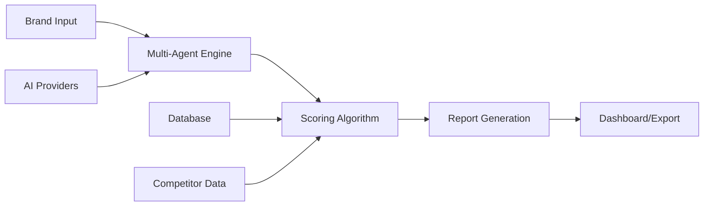

# AI Visibility Score - Project Implementation Plan

## Executive Summary

This document outlines the complete implementation plan for the AI Visibility Score platform - a multi-agent tool that evaluates brand visibility across AI-powered search and recommendation systems. The platform will deliver executive-ready reports with actionable insights for improving AI discoverability.

## Project Scope

### Core Deliverables
1. **Lite Dashboard**: Single-page executive summary with overall score and top actions
2. **Full Report**: Comprehensive 5-7 page analysis with detailed breakdowns
3. **Multi-Agent Evaluation Engine**: Tests across multiple AI providers (OpenAI, Anthropic, Google, etc.)
4. **Scoring System**: 8-dimension evaluation framework with 0-100 scoring
5. **Competitor Benchmarking**: Side-by-side analysis capabilities
6. **Actionable Roadmap**: Prioritized recommendations with timelines

### Target Users
- C-suite executives (CMOs, Chief Digital Officers)
- Brand/Marketing Directors
- Digital/SEO teams
- Consultancies and agencies

## Technical Architecture Overview

### Technology Stack
- **Frontend**: Next.js 14 with TypeScript, Tailwind CSS, Shadcn/ui
- **Backend**: Next.js API routes (serverless)
- **Database**: Supabase (PostgreSQL)
- **Authentication**: Supabase Auth
- **Deployment**: Vercel + Supabase
- **AI Integration**: Multi-provider system with API key management

### System Components

## Implementation Phases

### Phase 1: Foundation (Weeks 1-2)
**Goal**: Establish core infrastructure and basic functionality

#### Week 1: Project Setup
- [ ] Initialize Next.js project with TypeScript
- [ ] Configure Tailwind CSS and Shadcn/ui
- [ ] Set up Supabase project and database
- [ ] Implement authentication system
- [ ] Create basic project structure

#### Week 2: Core Infrastructure
- [ ] Design and implement database schema
- [ ] Create API key management system
- [ ] Build basic brand onboarding flow
- [ ] Set up AI provider integration framework
- [ ] Implement basic scoring algorithm structure

### Phase 2: Evaluation Engine (Weeks 3-4)
**Goal**: Build the multi-agent evaluation system

#### Week 3: AI Integration
- [ ] Implement OpenAI integration
- [ ] Implement Anthropic integration
- [ ] Create evaluation prompt templates
- [ ] Build test execution framework
- [ ] Add progress tracking system

#### Week 4: Scoring System
- [ ] Implement 8-dimension scoring algorithm
- [ ] Create Infrastructure & Machine Readability tests
- [ ] Create Perception & Reputation tests
- [ ] Create Commerce & Customer Experience tests
- [ ] Add result aggregation and analysis

### Phase 3: User Interface (Weeks 5-6)
**Goal**: Create intuitive dashboards and reporting

#### Week 5: Dashboard Development
- [ ] Design and build Lite Dashboard
- [ ] Create data visualization components
- [ ] Implement real-time evaluation progress
- [ ] Add executive summary generation
- [ ] Build basic competitor comparison

#### Week 6: Full Report System
- [ ] Design comprehensive report layout
- [ ] Implement detailed dimension breakdowns
- [ ] Create recommendation engine
- [ ] Add export functionality (PDF/sharing)
- [ ] Build competitor benchmarking interface

### Phase 4: Enhancement & Polish (Weeks 7-8)
**Goal**: Optimize performance and user experience

#### Week 7: Advanced Features
- [ ] Implement advanced competitor analysis
- [ ] Add historical tracking capabilities
- [ ] Create recommendation prioritization
- [ ] Build notification system
- [ ] Add data export capabilities

#### Week 8: Optimization & Launch Prep
- [ ] Performance optimization
- [ ] Mobile responsiveness
- [ ] Error handling and validation
- [ ] Documentation and user guides
- [ ] Deployment configuration

## Detailed Feature Specifications

### 1. Brand Onboarding Flow
**User Journey**: URL Input → Industry Selection → Competitor Setup → Evaluation Launch

**Features**:
- Website URL validation and crawling
- Industry categorization (dropdown with custom option)
- Competitor URL input (up to 5 competitors)
- Evaluation preferences (AI models to test)
- Progress tracking with estimated completion time

### 2. Multi-Agent Evaluation Engine
**Process**: Parallel testing across multiple AI providers with standardized prompts

**AI Provider Support**:
- OpenAI (GPT-4, GPT-3.5-turbo)
- Anthropic (Claude-3, Claude-2)
- Google (Gemini Pro)
- Configurable for additional providers

**Test Categories**:
- **Infrastructure Tests**: Schema markup, semantic clarity, knowledge graphs
- **Perception Tests**: Brand recognition, sentiment analysis, citation strength
- **Commerce Tests**: Product recommendations, shipping information

### 3. Scoring Algorithm
**Framework**: 8-dimension evaluation with weighted scoring

**Dimensions & Weights**:
1. **Schema & Structured Data** (10%) - Markup completeness and accuracy
2. **Semantic Clarity** (10%) - Content disambiguation and consistency
3. **Ontologies & Taxonomy** (10%) - Logical hierarchy and cross-linking
4. **Knowledge Graphs** (5%) - Internal and external KG presence
5. **LLM Readability** (5%) - Content structure and accessibility
6. **Geo Visibility** (10%) - Geographic search presence
7. **Citation Strength** (10%) - Media coverage and authority
8. **Answer Quality** (10%) - AI response accuracy and completeness
9. **Sentiment & Trust** (5%) - Reputation signals
10. **Hero Products** (15%) - Product recommendation accuracy
11. **Shipping & Freight** (10%) - Delivery information clarity

### 4. Dashboard Interfaces

#### Lite Dashboard (1-page)
- Overall AI Visibility Score (0-100)
- Letter grade (A-F)
- One-line verdict
- Strongest/weakest dimensions
- Top 3 priority actions
- Competitor comparison chart

#### Full Report (5-7 pages)
- Executive summary
- Detailed dimension analysis
- Competitor benchmarking
- Complete recommendation roadmap
- Implementation timeline
- ROI projections

### 5. Recommendation Engine
**Output**: Prioritized action items with timelines

**Priority Levels**:
- **Priority 1** (2 weeks): Immediate technical fixes
- **Priority 2** (30 days): Content and reputation improvements
- **Priority 3** (90 days): Strategic initiatives

**Recommendation Categories**:
- Technical (schema, markup, site structure)
- Content (semantic clarity, product descriptions)
- Reputation (citations, reviews, media coverage)
- Strategic (knowledge graph integration, AI optimization)

## Success Metrics

### Technical Metrics
- Evaluation completion time < 10 minutes
- 99.9% uptime for core services
- Support for 5+ AI providers
- Mobile-responsive design (100% compatibility)

### Business Metrics
- Clear, actionable recommendations for 100% of evaluations
- Executive-ready reports (C-suite approval rating)
- Competitive differentiation through AI-specific insights
- Scalable architecture supporting enterprise clients

## Risk Mitigation

### Technical Risks
- **AI Provider API Changes**: Modular integration design allows quick adaptation
- **Rate Limiting**: Intelligent queuing and caching systems
- **Performance**: Serverless architecture with automatic scaling
- **Data Security**: Encryption at rest and in transit, SOC 2 compliance

### Business Risks
- **Market Validation**: MVP approach with early user feedback
- **Competitive Response**: Focus on unique AI-specific insights
- **Scaling Costs**: Usage-based pricing model with cost controls

## Next Steps

1. **Immediate Actions**:
   - Set up development environment
   - Initialize Supabase project
   - Create basic Next.js application structure

2. **Week 1 Priorities**:
   - Complete project configuration
   - Implement authentication system
   - Design database schema

3. **Success Criteria for Phase 1**:
   - Working authentication system
   - Basic brand input functionality
   - Database schema implemented
   - AI provider integration framework ready

This plan provides a clear roadmap for delivering a comprehensive AI Visibility Score platform that meets the needs of enterprise clients while maintaining technical excellence and scalability.